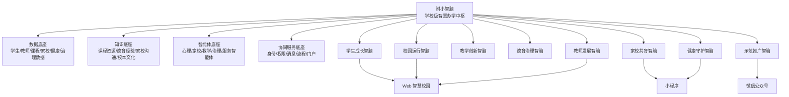

# “附小智脑”智慧校园建设方案

> 适用对象：学校领导班子、教育主管部门、项目建设决策层、合作单位与示范推广交流场景。  
> 编制定位：立足龙岩师范附属小学智慧校园现有建设基础，面向全国顶尖基础教育引领示范校高端定位，提出“附小智脑”智慧校园建设的总体规划、建设路径、运营机制与示范推广方案。  
> 建设基调：高站位谋划、高标准建设、高质量运营、高水平示范，打造可感知、可运行、可推广的名校专属智慧办学样板。

## 一、建设背景与时代方位

当前，教育数字化正由“工具应用”进入“体系重构”新阶段。国家层面持续推进教育数字化战略行动，强调以数字化开辟教育发展新赛道、塑造教育发展新优势；智慧教育建设正在从资源上云、平台互联，迈向人工智能深度赋能育人方式、办学模式、管理机制和教育治理能力现代化的新阶段。

基础教育作为教育强国建设的根基，正在面临三重深刻变化：一是学生成长需求更加多元，学校需要更精细、更连续、更有温度地理解儿童；二是教师专业发展与工作减负并重，学校需要用智能技术支撑教师把更多精力回归育人本身；三是优质学校的示范责任不断提升，名校不只要办好一所学校，更要沉淀可复制、可辐射、可输出的办学经验和数字化模式。

龙岩师范附属小学作为基础教育高质量发展的引领型学校，已经具备建设“附小智脑”的坚实基础：现有智慧校园系统已覆盖学校门户、统一认证、校领导驾驶舱、教务教研、德育管理、体育健康、心理健康、家校沟通智能体、教师空间、家长端、云教学、课后服务、智慧作业、审批与消息通知等核心场景，初步形成了“数据采集、智能分析、业务预警、协同处置”的数字化闭环。

在此基础上，建设“附小智脑”，不是对现有系统的简单叠加升级，而是以学校办学理念、育人特色、课程文化、治理经验为灵魂，以人工智能、数据治理和业务协同为支撑，构建一个能够感知学校运行、理解学生成长、支撑教师发展、联动家校社资源、沉淀办学经验、输出示范模式的智慧办学中枢。

## 二、总体定位

“附小智脑”是面向未来智慧校园的学校级智能中枢，是龙岩师范附属小学数字化转型的核心工程，是学校从“应用型智慧校园”迈向“智能型未来学校”的关键支点。

其总体定位为：

> 以学生全面而有个性的发展为中心，以教师专业成长和学校治理现代化为支撑，以 AI 智能体、数据中台、知识中台和业务协同中台为底座，建设联通校园系统、小程序、微信公众号和未来多终端入口的“附小智脑”，形成一套具有附小文化辨识度、基础教育示范性、区域辐射带动力和全国推广价值的智慧办学新范式。

“附小智脑”应突出四个核心特质：

1. 先行先试：面向国家教育数字化战略前沿，率先探索人工智能赋能小学教育教学、学生成长、家校共育和学校治理的实践路径。
2. 标杆引领：以高标准场景建设、高质量数据治理、高水平智能应用，打造可观摩、可验证、可复制的智慧校园标杆。
3. 经验辐射：将附小成熟的课程资源、德育经验、家校沟通方法、健康成长支持体系沉淀为数字化资源与模型，向区域学校辐射。
4. 模式输出：形成“理念、平台、资源、机制、标准、案例”六位一体的输出体系，为全国基础教育智慧校园建设提供附小样板。

## 三、指导思想与建设原则

### （一）指导思想

坚持以立德树人为根本任务，全面贯彻党的教育方针，服务德智体美劳全面培养，落实教育数字化战略行动要求，顺应人工智能与教育深度融合趋势，立足龙岩师范附属小学办学基础和文化特色，以“儿童成长、教师发展、学校治理、家校共育、示范辐射”为主线，系统推进“附小智脑”建设。

通过建设学校级智慧办学中枢，推动学校从经验治理走向数据辅助治理，从单点应用走向系统协同，从资源建设走向知识生产，从校内服务走向区域示范，从数字校园走向未来学校。

### （二）建设原则

1. 育人为本，儿童立场。所有智能应用必须服务学生健康成长、全面发展与个性发展，避免技术中心主义，坚守教育温度。
2. 文化铸魂，附小表达。将学校办学理念、附小少年成长文化、名师队伍、课程传统、德育特色、家校共育经验融入系统设计，形成独有辨识度。
3. 数据贯通，业务协同。打破教务、德育、健康、心理、家校、课程、后勤等场景之间的信息孤岛，形成围绕学生成长和学校治理的全链路数据流。
4. AI 赋能，人机共育。人工智能不替代教师、不替代管理者，而是成为教师助手、学生伙伴、家长桥梁、学校治理参谋。
5. 安全可信，审慎稳妥。坚持数据安全、隐私保护、算法可控、伦理合规，尤其重视未成年人数据保护和心理健康、家校沟通等敏感场景的分级授权。
6. 试点先行，迭代推广。以高价值场景先行突破，以真实使用持续优化，以制度机制保障常态运营，以标准案例支撑对外输出。

## 四、建设目标

### （一）总体目标

用三年左右时间，建成以“附小智脑”为核心的智慧校园新体系，形成“一个智能中枢、四类基础底座、八大核心场景、三套运营机制、一个示范输出体系”的总体格局，将龙岩师范附属小学打造成为全国基础教育智慧校园建设的高端样板校、人工智能赋能小学教育的先行示范校、数字化支撑名校办学经验输出的标杆学校。

### （二）阶段目标

第一阶段，夯实底座、形成中枢。整合现有智慧校园系统，统一身份、数据、消息、知识、智能体入口，形成“附小智脑”基础框架，优先打通学生成长、教师空间、家校沟通、校领导驾驶舱等关键场景。

第二阶段，智能赋能、闭环运行。围绕体育健康、心理健康、家校沟通、云教学、智慧作业、课后服务、班级治理等特色场景，形成可持续运行的智能分析、预警研判、协同处置和成长反馈闭环。

第三阶段，示范引领、模式输出。沉淀附小智慧办学标准、课程资源、应用案例、治理机制和培训体系，支撑校内提质、区域辐射、对外展示和全国推广。

### （三）量化建设导向

1. 建成 1 个学校级智能中枢：“附小智脑”。
2. 建成 4 类基础底座：数据底座、知识底座、智能体底座、协同服务底座。
3. 建成 8 大核心应用群：学生成长、教师发展、教学创新、德育治理、家校共育、健康守护、校园运行、示范推广。
4. 形成 N 个特色智能体：暖心童童、心心、备课助手、作业助手、课后服务助手、课程资源助手、校务治理助手等。
5. 打通 3 类服务入口：校园 Web 平台、小程序、微信公众号。
6. 输出 1 套附小智慧校园建设标准与示范案例库。

## 五、总体架构

“附小智脑”总体架构建议采用“一脑统领、四座支撑、八域协同、三端联通、全程安全”的建设框架。

### （一）一脑统领

“附小智脑”作为学校智慧办学总入口、总调度、总分析、总服务平台，承载四项核心能力：

1. 能看见：汇聚学校运行和学生成长关键数据，形成校级、年级、班级、学生多层级画像。
2. 能理解：通过知识库、规则库、模型能力和业务上下文，理解教育教学与校园治理场景。
3. 能建议：面向教师、管理者、家长生成行动建议、风险提示、资源推荐和决策参考。
4. 能协同：通过消息、审批、任务、预警、流程，把发现的问题转化为可跟进、可留痕、可复盘的行动闭环。

### （二）四座支撑

1. 数据底座。整合学生、教师、班级、课程、课表、德育、体质健康、心理健康、家校沟通、课后服务、审批、消息、后勤等数据，形成统一数据资产。
2. 知识底座。沉淀学校课程资源、校本教研成果、德育案例、家校沟通话术、健康处方、心理支持知识、管理制度和校园文化内容。
3. 智能体底座。统一建设心理陪伴、家校沟通、备课命题、课后服务、校务治理等智能体能力，形成可持续扩展的智能服务体系。
4. 协同服务底座。统一身份认证、权限管理、消息通知、审批流程、任务流转、文件服务和多端接入能力。

### （三）八域协同

围绕学校办学全场景，形成八大应用域：

1. 学生成长智脑：学生画像、德育成长、体质健康、心理状态、习惯养成、荣誉发展、学习支持。
2. 教师发展智脑：教师画像、工作台、备课支持、教研成长、家校沟通支持、班级 SOP、教师减负。
3. 教学创新智脑：云教学、课程数字化、智慧作业、智能备课、在线教研、资源开发。
4. 德育治理智脑：习惯养成、德育活动、班级常规、学生荣誉、家校风险处置。
5. 家校共育智脑：家长端服务、心心智能体、家校预警、家庭观察、信息收集、通知协同。
6. 健康守护智脑：体育健康报告、健康画像、健康处方、心理陪伴、风险预警、家校干预。
7. 校园运行智脑：资产、设备、报修、采购、财务、安全、门禁、环境、审批。
8. 示范推广智脑：课程资源输出、案例库、标准规范、培训服务、对外展示、区域共建。

### （四）三端联通

1. Web 智慧校园：面向校领导、教师、职能部门和管理人员，承载高频业务办理、管理驾驶舱、数据看板和智能体入口。
2. 小程序：面向家长、学生和教师移动端场景，承载家校沟通、通知、健康报告、课后选课、信息采集、成长反馈等服务。
3. 微信公众号：面向学校品牌传播、课程展示、活动发布、家长服务、示范推广和社会影响力建设，形成“服务入口 + 品牌窗口 + 资源传播平台”。

## 六、核心建设内容

### （一）建设学校级“附小智脑”中枢

建设统一的“附小智脑”首页和中枢能力，以校领导驾驶舱、教师工作台、家长服务台、示范展示台为主要入口，形成面向不同角色的智能服务界面。

重点建设内容包括：

1. 校级运行总览：展示学生发展、教师发展、课程建设、健康安全、家校协同、校园运行等关键指标。
2. 智能问答入口：支持学校制度、课程资源、业务流程、学生成长、家校沟通等多类问答。
3. 智能预警中心：统一承载心理健康预警、家校沟通预警、健康风险提示、安全隐患、审批超期等提醒。
4. 智能任务中心：将预警、审批、通知、待办、跟进事项统一汇聚，形成“发现、派发、处理、反馈、复盘”的闭环。
5. 资源推荐中心：根据教师、学生、家长、管理者不同需求，推荐课程、活动、制度、案例、话术、处方和培训资源。
6. 学校知识门户：沉淀附小制度、课程、文化、案例、荣誉、名师、活动和数字资源，形成学校知识资产库。

### （二）建设学生成长智脑

学生成长智脑是“附小智脑”的核心。其目标是将学生在学习、健康、心理、德育、习惯、活动、荣誉、家庭反馈等方面的数据连接起来，形成“一生一档、一生一像、一生一策”的成长支持体系。

重点建设内容包括：

1. 学生成长画像。整合基础信息、班级信息、学习记录、体质健康、心理互动、德育表现、习惯打卡、荣誉申报、课后服务参与、家长观察等数据，形成学生成长全景画像。
2. 多模态体育健康报告。基于体测、体检、运动记录、睡眠饮食、家庭观察、健康画像和健康处方，生成面向学生、家长、教师和管理者的分层健康报告。
3. 心理健康陪伴与预警。依托“暖心童童”等心理健康对话智能体，为学生提供低压力表达入口，同时对高风险内容进行分级预警、脱敏呈现和专业转介。
4. 德育成长档案。汇聚习惯养成、德育活动、班级常规、学生荣誉、行为表现等数据，形成德育过程记录和成长反馈。
5. 个性化成长建议。基于学生画像生成运动建议、习惯目标、心理支持建议、学习资源推荐和家校协同建议。

该模块的示范意义在于：将学校对学生的关心从“结果评价”推进到“过程陪伴”，从“单点记录”推进到“全景理解”，从“统一要求”推进到“个性支持”。

### （三）建设教师发展智脑

教师发展智脑面向教师专业成长、日常工作减负和班级治理支持，突出“把技术还给教师时间，把智能转化为专业支持”。

重点建设内容包括：

1. 教师工作台。整合课表、待办、通知、审批、班级事务、课程资源、教研活动、健康预警、家校沟通等内容，形成一站式工作入口。
2. 智能备课助手。围绕课标、教材、学情、资源、教学目标、活动设计、作业设计，辅助教师生成备课思路和教学材料。
3. 智慧作业助手。支持命题、双向细目表、题目结构化、知识点标注、作业设计、试卷生成和作业讲评建议。
4. “心心”家校沟通智能体。面向班主任和任课教师，提供家校沟通情绪承托、问题破译、沟通支架、话术防线检查、会话留痕和风险预警。
5. 班级 SOP 智能台账。将班级事务、常规流程、责任分工、过程证据和结果反馈结构化，降低班主任经验依赖。
6. 教师成长档案。沉淀教师课程、教研、荣誉、工作量、培训、资源贡献、家校沟通能力等数据，服务教师专业发展。

该模块的示范意义在于：让人工智能真正进入教师工作真实现场，既减轻事务负担，又增强教师专业判断和教育行动能力。

### （四）建设教学创新智脑

教学创新智脑以学校课程数字化、资源开发和教研转型为重点，支撑附小优质课程从“校内经验”走向“数字资产”，从“名师个人积累”走向“学校组织能力”。

重点建设内容包括：

1. 云教学服务。支持教师研修课程、家长课程、学生课程、直播课程、录播课程、章节资源、学习进度、课程评论和精准推送。
2. 校本课程资源库。围绕学校特色课程、德育活动、附小少年成长课程、名师课堂、家长学校等内容，建设可持续更新的课程资源体系。
3. 课程开发协同。支持课程设计、资源上传、章节编排、学习任务、评价反馈、课程复盘和资源再加工。
4. 在线教研。沉淀教研主题、阶段活动、资源材料、成果展示和教师参与记录，形成校本教研数字化过程。
5. 资源辐射机制。对优质课程进行标准化封装，支持区域学校学习、观摩、引用和共建。

该模块的示范意义在于：把名校课程优势转化为可沉淀、可传播、可评价、可共建的数字资源体系，支撑学校经验向外输出。

### （五）建设德育治理智脑

德育治理智脑以“立德树人、五育融合、过程育人”为核心，推动德育工作从活动管理走向数据支撑、从经验判断走向协同治理。

重点建设内容包括：

1. 德育活动管理。支持活动发布、对象设置、材料提交、审核归档和成果展示。
2. 习惯养成系统。支持目标模板、学生月目标、每日打卡、家长参与、教师审核、班级统计和学校分析。
3. 学生荣誉体系。支持荣誉活动、家长申报、教师审核、德育审批、撤回留痕和成长档案沉淀。
4. 班级常规评价。支持常规评分、值日管理、班级排名、年级对比和改进建议。
5. 家校风险协同。承接“心心”智能体触发的家校沟通预警，实现德育处查看、研判、处置、备注和复盘。

该模块的示范意义在于：把德育工作从“活动化呈现”提升为“过程化育人、数据化支持、组织化协同”的新形态。

### （六）建设家校共育智脑

家校共育智脑以“信任、协同、支持、预警”为关键词，将家长端、小程序、微信公众号、“心心”智能体和学校德育体系联通起来，形成更温和、更专业、更高效的家校共育机制。

重点建设内容包括：

1. 家长服务入口。通过小程序和 Web 家长端提供通知公告、学生信息、健康报告、云课程、课后选课、荣誉申报、信息采集、习惯打卡等服务。
2. 微信公众号联动。将公众号打造为学校品牌传播、课程展示、家长服务、活动发布和示范推广的重要窗口。
3. “心心”教师端支持。帮助教师面对复杂家校沟通时获得专业支架，减少情绪消耗和沟通风险。
4. 家校沟通预警。对法律安全风险、教师心理承载风险、极端投诉风险、冲突升级风险进行脱敏预警和闭环处置。
5. 家长学校数字化。依托云教学课程，建设家长课程、家庭教育指导资源和家校共育案例库。

该模块的示范意义在于：不是把家校沟通简单线上化，而是通过智能支撑与组织机制，让家校关系更专业、更稳定、更有建设性。

### （七）建设健康守护智脑

健康守护智脑聚焦体育健康、心理健康和学生安全成长，将体质健康、运动习惯、家庭观察、心理陪伴、风险预警和干预建议联动起来。

重点建设内容包括：

1. 体育健康数据中心。汇聚体测、体检、运动、健康观察、健康处方和周期报告。
2. 学生健康画像。形成面向个体、班级、年级、学校的健康状态分析。
3. 健康处方。结合学生体质特点和家庭观察，生成个性化运动建议、生活建议和家校协同建议。
4. 心理健康风险中心。对学生心理对话、授权访问、预警记录和处置情况进行分级管理。
5. 健康趋势研判。为校领导、体育教师、班主任和家长提供不同视角的健康趋势分析。

该模块的示范意义在于：把“健康第一”的教育理念落实为可感知、可跟踪、可干预的数字化机制。

### （八）建设校园运行智脑

校园运行智脑面向学校治理现代化，覆盖总务后勤、资产设备、报修采购、财务报销、安全演练、门禁访客、审批流程和消息通知等场景。

重点建设内容包括：

1. 校领导驾驶舱。按校长、书记、教学副校长、德育副校长、总务副校长等角色，提供差异化治理看板。
2. 总务后勤协同。统一资产、设备、报修、采购、环境、后勤人员等管理。
3. 安全管理闭环。支持安全演练、巡检、隐患处理、门禁访客、通行记录和风险统计。
4. 审批流程中心。统一请假、调课、采购、报销、场地预约等流程，形成标准化审批和留痕。
5. 消息通知中心。贯通学校通知、部门消息、家长通知、待办提醒和预警消息。

该模块的示范意义在于：把学校治理从“人工分散处理”推进到“流程统一、数据透明、责任闭环、决策有据”。

### （九）建设示范推广智脑

示范推广智脑是“附小智脑”区别于一般智慧校园项目的重要内容。它面向高端示范校定位，服务学校品牌影响、区域辐射和全国推广。

重点建设内容包括：

1. 附小智慧校园展示中心。面向教育主管部门、兄弟学校、合作单位和社会公众，展示学校智慧办学成果。
2. 附小经验案例库。沉淀学生成长、体育健康、心理健康、家校沟通、课程数字化、智慧作业、班级治理等典型案例。
3. 附小课程资源输出平台。将名师课堂、校本课程、家长学校、教师研修课程等形成可共享资源。
4. 标准与指南。形成《附小智脑建设标准》《智慧家校共育操作指南》《学生健康画像应用指南》《智慧班级治理 SOP 指南》等成果。
5. 师训与观摩体系。支撑区域教师培训、校长研修、现场观摩、线上研讨和成果发布。
6. 品牌传播体系。联动学校门户、微信公众号、小程序和示范展示页面，形成可持续传播的智慧教育品牌。

该模块的示范意义在于：让附小不仅成为智慧校园使用者，更成为智慧教育模式的生产者、定义者和输出者。

## 七、重点特色场景设计

### （一）多模态学生体育健康报告

建设“学生体育健康成长报告”，融合体测、体检、运动、家庭观察、健康画像、健康处方和周期趋势，形成面向不同角色的报告体系。

面向学生：用儿童可理解的方式反馈运动优势、健康习惯和下一阶段目标。

面向家长：说明孩子身体发展趋势、家庭观察建议和运动支持方法。

面向教师：提示班级整体体质情况、需要关注的学生和适宜的运动干预建议。

面向学校：形成年级、班级、性别、项目维度的体质健康分析，为课程安排、体育活动和健康教育提供依据。

特色价值：该场景能够充分体现学校对学生生命成长的关注，把体育健康从“测评结果”提升为“成长服务”。

### （二）学生心理健康对话智能体与预警系统

建设“暖心童童”学生心理健康智能体，形成日常陪伴、风险识别、隐私保护、专业介入和处置留痕的心理健康数字化支持体系。

核心机制包括：

1. 学生低压力表达入口。
2. 心理健康知识库辅助回应。
3. 敏感内容与红线风险识别。
4. 会话脱敏与分级授权。
5. 心理预警闭环处理。
6. 班主任、心理教师、德育部门分级协同。

特色价值：让心理健康工作从定期筛查向日常陪伴延伸，从事后发现向前端预警延伸，从个人经验向组织闭环延伸。

### （三）家校沟通智能体“心心”与预警系统

建设“心心”家校沟通智能体，面向教师尤其是班主任，提供情绪承托、现象破译、沟通支架、话术生成、风险防线检查和会后复盘。

“心心”的核心不是替教师说话，而是帮助教师更专业地理解家长诉求、更稳妥地回应复杂情境、更及时地识别高风险事件。

重点机制包括：

1. 家校沟通知识库增强。
2. 教师端流式对话支持。
3. 会话记录留痕。
4. 德育处会话查看。
5. 法律安全风险预警。
6. 教师心理承载风险预警。
7. 脱敏结构化上报。
8. 预警处理闭环。

特色价值：该场景是附小智慧校园最具辨识度的特色之一，体现了学校对教师的保护、对家校关系的专业治理、对风险事件的前置发现和组织承接能力。

### （四）云教学服务与学校课程数字化

建设云教学服务体系，将学校课程、活动、培训、教研成果和特色资源数字化沉淀，形成可运营、可共享、可评价、可推广的课程资源平台。

重点场景包括：

1. 名师课堂数字化。
2. 校本课程线上化。
3. 家长学校课程化。
4. 教师研修常态化。
5. 学生拓展课程资源化。
6. 课程学习数据分析。
7. 区域课程共享输出。

特色价值：把附小的名校课程优势从“校内资源”转化为“数字资产”，支撑学校经验辐射和品牌输出。

### （五）智慧作业与智能备课

建设智慧作业与智能备课体系，支撑教师围绕课标、教材、学情和教学目标进行结构化教学设计。

重点场景包括：

1. 智能命题。
2. 双向细目表。
3. 题目知识点标注。
4. 作业结构化生成。
5. 试卷生成与规范排版。
6. 备课文本分析。
7. 教学资源推荐。

特色价值：将教师个人经验转化为可复用、可分析、可沉淀的教学设计能力，推动教研从“经验交流”走向“数据支持”。

### （六）课后服务智能运营

建设课后服务智能运营能力，从课程申请、课程审核、家长选课、学生报名、点名册、课程评价到 AI 辅助反馈，形成完整闭环。

重点场景包括：

1. 课程需求预测。
2. 家长选课咨询。
3. 课程智能推荐。
4. 课程内容生成。
5. 学生个性化反馈。
6. 课程质量分析。

特色价值：让课后服务从“排课选课管理”升级为“课程供给优化与学生发展服务”。

### （七）班级 SOP 智能台账

建设班级 SOP 智能台账，将班级常规事务、关键流程、责任分工、执行记录、过程证据和复盘结果结构化。

重点场景包括：

1. 班级事务模板。
2. 执行步骤管理。
3. 责任人分配。
4. 过程材料上传。
5. 状态跟踪。
6. 复盘沉淀。

特色价值：降低班主任经验依赖，帮助青年教师快速掌握班级治理方法，推动附小班级管理经验标准化输出。

## 八、技术路线

### （一）总体技术路线

“附小智脑”采用“统一门户 + 数据中台 + 知识中台 + 智能体平台 + 业务应用群 + 多端服务”的技术路线。

1. 前端采用 Web、小程序、微信公众号多端协同。
2. 后端采用统一 API 服务体系和业务服务层。
3. 数据层以 PostgreSQL/Supabase 为核心，逐步沉淀统一数据资产。
4. 智能层接入大模型、知识库检索、智能体编排和规则预警。
5. 安全层建设统一身份、权限、日志、脱敏、审计和风控机制。

### （二）智能体建设路线

1. 场景智能体：围绕心理、家校、备课、作业、课后服务、校务治理建设专用智能体。
2. 知识增强：每个智能体绑定对应知识库、制度库、案例库和业务数据。
3. 人机协同：智能体输出建议，最终决策和处置由教师、管理者和专业人员完成。
4. 过程留痕：关键对话、预警、建议和处理结果进入业务闭环。
5. 持续迭代：通过使用反馈、案例复盘和知识库更新持续提升智能体质量。

### （三）数据治理路线

1. 建立统一数据目录，明确数据来源、责任部门、更新频率、质量标准和使用边界。
2. 建立学生、教师、班级、课程、家长、资源等核心主数据标准。
3. 建立敏感数据分级分类制度，对心理、健康、家校沟通、家庭信息等高敏数据进行严格保护。
4. 建立数据质量监测机制，及时发现缺失、重复、异常和不一致数据。
5. 建立数据应用审批机制，确保数据使用服务育人、治理和正当业务需要。

## 九、数据安全、伦理治理与风险防控

“附小智脑”服务对象包含未成年人、教师和家长，必须把安全可信作为建设底线。

### （一）数据安全

1. 对学生个人信息、家庭信息、健康信息、心理信息、会话内容等敏感数据进行分级分类管理。
2. 建立最小权限访问机制，按角色、部门、班级、学生关系进行数据授权。
3. 对高敏数据采用脱敏展示、访问审计、异常访问提醒和操作留痕。
4. 对数据导出、批量查询、跨端共享设置严格审批和日志记录。
5. 建立数据备份、恢复、容灾和安全巡检机制。

### （二）算法与 AI 伦理

1. AI 仅提供辅助建议，不作为学生评价、教师评价和重大处置的唯一依据。
2. 心理健康、家校风险、学生成长建议等敏感场景必须保留人工复核。
3. 对 AI 输出进行边界提示，避免过度承诺、标签化学生、替代专业判断。
4. 建立智能体知识库审核机制，确保内容符合教育规律、学校制度和伦理要求。
5. 建立 AI 使用反馈和纠错机制，允许教师和管理者标记不准确、不适宜、不完整的输出。

### （三）未成年人保护

1. 严格控制学生心理对话、健康报告、家庭观察等信息的访问范围。
2. 对学生敏感表达采用分级预警和脱敏呈现，避免无关人员接触原始隐私。
3. 对家长端展示内容进行教育性表达，避免制造焦虑或形成简单标签。
4. 对高风险预警建立专业处置流程，防止系统提示停留在“发现”层面。

## 十、实施路径与阶段安排

### 第一阶段：基础整合与中枢成型

建设周期建议为 3 至 6 个月。

重点任务：

1. 梳理现有系统功能、数据表、接口和角色权限。
2. 建设“附小智脑”统一入口和基础驾驶舱。
3. 打通统一身份、统一消息、统一待办和统一预警中心。
4. 梳理学生、教师、班级、课程、家长等核心主数据。
5. 完成“心心”、心理健康、体育健康、云教学等特色模块的中枢接入。
6. 建立数据安全、权限管理和日志审计基础规范。

阶段成果：

1. “附小智脑”基础版上线。
2. 校领导、教师、家长三类核心入口初步联通。
3. 学生成长、教师工作、家校预警、健康报告等重点数据可视化。

### 第二阶段：特色场景深化与闭环运行

建设周期建议为 6 至 12 个月。

重点任务：

1. 深化多模态学生体育健康报告。
2. 完善心理健康智能体与预警处置闭环。
3. 完善“心心”家校沟通智能体与德育处协同机制。
4. 建设云教学课程资源运营体系。
5. 完善智慧作业、智能备课和课后服务智能运营。
6. 建设学生成长画像和教师发展画像。
7. 建立预警分级处置、跨部门协同和复盘机制。

阶段成果：

1. 形成 3 至 5 个可展示、可观摩、可复用的智慧教育标杆场景。
2. 形成学生成长、教师发展、家校共育、健康守护的闭环应用。
3. 形成附小特色数据报告和典型案例。

### 第三阶段：示范推广与模式输出

建设周期建议为 12 至 24 个月。

重点任务：

1. 建设附小智慧校园展示中心。
2. 建设附小智慧教育案例库和课程资源输出平台。
3. 编制附小智脑建设标准、操作指南和应用白皮书。
4. 建设区域教师培训、校长研修和线上观摩机制。
5. 支持对外展示、经验交流、课题研究、成果评估和品牌传播。

阶段成果：

1. 形成“附小智脑”智慧校园建设样板。
2. 形成可推广的应用模式、资源体系和制度机制。
3. 形成区域辐射和全国展示的标志性成果。

## 十一、运营机制

“附小智脑”建设不能停留在项目交付层面，必须建立长期运营机制。

### （一）组织运营机制

建议成立“附小智脑”建设与运营领导小组，由学校主要领导牵头，教务、德育、总务、信息化、年级组、教研组、心理健康、体育健康、家校沟通等相关负责人参与。

下设四类工作专班：

1. 数据治理专班：负责数据标准、数据质量、数据安全和数据应用审核。
2. 场景建设专班：负责学生成长、教师发展、家校共育、云教学等场景落地。
3. 智能体运营专班：负责知识库维护、提示词优化、风险规则、使用反馈和效果评估。
4. 示范推广专班：负责案例沉淀、资源输出、观摩接待、培训推广和品牌传播。

### （二）日常运营机制

1. 周监测：对预警、待办、系统使用、数据异常进行周度监测。
2. 月复盘：按月复盘学生成长、家校沟通、健康预警、课程资源、课后服务等关键场景。
3. 学期评估：每学期形成智慧校园运行报告，服务学校管理改进。
4. 年度发布：每年形成《附小智脑智慧教育应用报告》或白皮书，支撑对外展示和经验输出。

### （三）资源运营机制

1. 课程资源持续更新：建立名师课程、校本课程、家长课程、教师研修课程更新计划。
2. 案例资源持续沉淀：将优秀班级治理案例、家校沟通案例、健康干预案例、心理支持案例标准化。
3. 知识库持续维护：定期更新制度、话术、课程、教研成果和风险规则。
4. 应用反馈持续优化：建立教师、家长、学生和管理者反馈渠道，持续优化智能体和业务流程。

## 十二、示范推广体系

### （一）示范展示

建设“附小智脑”智慧校园展示体系，形成“现场观摩 + 数据看板 + 场景演示 + 案例讲解 + 资源体验”的综合展示能力。

重点展示内容：

1. 一屏总览：展示学校智慧办学整体格局。
2. 一生一像：展示学生成长画像和健康报告。
3. 一师一助：展示教师工作台、备课助手和心心智能体。
4. 一课一链：展示云教学课程数字化与资源开发。
5. 一事一闭环：展示预警、审批、处置、复盘全过程。
6. 一校一模式：展示附小智脑建设标准和输出成果。

### （二）经验辐射

面向区域学校，输出四类经验：

1. 智慧校园建设经验：系统架构、数据治理、权限安全、场景落地。
2. 智慧育人经验：学生画像、体育健康报告、心理健康预警、德育成长档案。
3. 智慧教学经验：云教学、智能备课、智慧作业、在线教研、课程资源建设。
4. 智慧治理经验：校领导驾驶舱、班级 SOP、家校预警、审批协同、后勤运行。

### （三）模式输出

形成“1+N”输出模式：

1 是“附小智脑”总体建设方案和标准体系。

N 是可拆分推广的特色场景包，包括：

1. 学生体育健康成长报告场景包。
2. 心理健康智能体与预警场景包。
3. 家校沟通智能体“心心”场景包。
4. 云教学与校本课程数字化场景包。
5. 智慧作业与智能备课场景包。
6. 班级 SOP 智能台账场景包。
7. 校领导智慧驾驶舱场景包。
8. 家校共育小程序与公众号联动场景包。

### （四）成果发布

建议围绕“附小智脑”形成以下成果：

1. 《附小智脑智慧校园建设方案》。
2. 《附小智脑应用白皮书》。
3. 《附小智慧家校共育指南》。
4. 《附小学生体育健康成长报告样例》。
5. 《附小心理健康智能支持应用规范》。
6. 《附小云教学课程资源建设规范》。
7. 《附小智慧班级治理 SOP 案例集》。
8. “附小智脑”示范课、示范活动、示范培训资源包。

## 十三、预期成效

### （一）对学生

学生将获得更连续、更个性、更温暖的成长支持。体育健康、心理状态、学习过程、德育表现和家庭观察不再分散孤立，而是汇聚为完整成长画像，帮助学校更早发现需要支持的学生，更精准提供成长建议。

### （二）对教师

教师将获得更有效的工作支持。备课、作业、家校沟通、班级事务、课程资源、审批待办等高频场景获得智能辅助，教师从重复性事务中释放出来，把更多精力投入课堂教学、学生理解和专业成长。

### （三）对家长

家长将获得更清晰、更及时、更可信的学校服务。通过小程序和微信公众号，家长能够更方便地了解孩子成长、接收学校通知、参与家校共育、学习家庭教育课程，并在沟通中获得更专业的支持。

### （四）对学校治理

学校将形成更加现代化的治理能力。校领导能够实时掌握学校运行态势，职能部门能够按流程协同处置，关键风险能够提前识别，重要工作能够留痕复盘，学校管理从经验驱动走向数据与专业共同驱动。

### （五）对区域与全国示范

附小将形成可观摩、可复制、可培训、可输出的智慧校园建设样板，在人工智能赋能基础教育、学生成长数字化、家校共育智能化、校本课程资源化、名校经验模式化等方面形成具有全国推广价值的实践成果。

## 十四、保障措施

### （一）组织保障

建立学校主要领导牵头、各部门协同、年级组和教研组共同参与的工作机制，将“附小智脑”纳入学校重点发展工程，明确建设责任、运行责任和应用责任。

### （二）制度保障

制定数据管理、权限管理、智能体使用、预警处置、内容审核、资源发布、案例沉淀、对外共享等制度，确保系统建设有章可循、运行有序。

### （三）队伍保障

培养一批智慧校园种子教师、数据管理员、智能体运营员、课程资源建设骨干和示范推广讲师，形成校内可持续运营队伍。

### （四）安全保障

建立技术安全、数据安全、内容安全、算法安全和未成年人保护机制，确保“附小智脑”安全、可信、可控。

### （五）评价保障

建立“使用率、满意度、减负成效、育人成效、治理成效、示范成效”相结合的评价体系，定期评估建设效果并持续优化。

## 十五、结语

建设“附小智脑”，是龙岩师范附属小学站位教育强国建设、顺应智慧教育发展、彰显名校责任担当的重要战略工程。它既是一个技术平台，更是一套面向未来的智慧办学体系；既服务学校内部提质增效，也服务优质教育经验的沉淀、传播和辐射；既体现国家教育数字化前沿方向，也体现附小深厚的文化底蕴、育人温度和示范追求。

面向未来，“附小智脑”将推动学校形成更加鲜明的智慧办学样板：以数据看见每一个儿童，以智能支持每一位教师，以平台联结每一个家庭，以资源辐射更多学校，以模式服务基础教育高质量发展。

最终，龙岩师范附属小学将不只是建设一套智慧校园系统，而是形成一个有文化、有温度、有智慧、有标准、有影响力的未来学校新范式，为全国基础教育数字化转型贡献“附小方案”、提供“附小样板”、输出“附小经验”。

## 附录：政策与建设依据

1. 《教育强国建设规划纲要（2024—2035年）》提出以教育数字化开辟发展新赛道、塑造发展新优势，为基础教育数字化转型提供了顶层依据。
2. 国家教育数字化战略行动持续推进，国家智慧教育平台建设不断深化，为学校建设智慧校园、发展智慧教育提供了国家级平台方向和实践参照。
3. 《中国智慧教育白皮书》及国家教育数字化战略行动 2.0 强调集成化、智能化、国际化发展方向，为“附小智脑”建设提供了智慧教育阶段的战略参照。
4. 教育部关于加强中小学人工智能教育的部署强调坚持立德树人、以人为本、统筹谋划、鼓励有条件地区和学校先行先试，为附小开展人工智能赋能基础教育实践提供了政策支撑。
5. 国家中小学智慧教育平台全域应用试点强调全域、全员、全流程应用和人工智能规模化应用，为附小建设可示范、可复制、可辐射的智慧校园模式提供了实践方向。

参考来源：

- 教育部：《教育强国建设规划纲要（2024—2035年）》专题，https://www.moe.gov.cn/jyb_xwfb/xw_zt/moe_357/2025/2025_zt02/
- 教育部：《中国智慧教育白皮书》和启动国家教育数字化战略行动2.0，https://www.moe.gov.cn/jyb_xwfb/xw_zt/moe_357/2025/2025_zt06/cgfb/202505/t20250507_1189603.html
- 教育部：以“人工智能+教育”奋力开创教育数字化新格局，https://www.moe.gov.cn/jyb_xwfb/s5148/202604/t20260402_1432732.html
- 教育部：教育部部署加强中小学人工智能教育，https://www.moe.gov.cn/jyb_xwfb/gzdt_gzdt/s5987/202412/t20241202_1165500.html
- 教育部：国家中小学智慧教育平台启动全域应用试点，https://www.moe.gov.cn/jyb_xwfb/gzdt_gzdt/s5987/202403/t20240328_1122880.html
