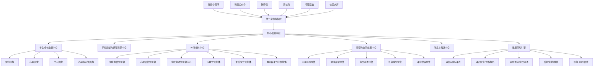

# 智慧校园特色能力与“附小智脑”未来图景建议

## 一、文档定位

本文件面向产品汇报、客户交流与项目方案展示，基于当前智慧校园系统已有建设基础，提炼系统中最能体现“特”的能力，并进一步提出“附小智脑”的升级建议。

当前系统已经不只是一个常规的校园事务管理平台，而是在健康、心理、教学、家校、课后服务、班级治理等多个场景中形成了“数据采集 + 智能分析 + 业务预警 + 协同处置”的雏形。其核心特色可以概括为：

> 以学生成长为中心，以 AI 智能体为牵引，以数据联动为底座，逐步从“智慧校园应用集合”升级为“学校治理与育人服务智能中枢”。

## 二、智慧校园“特”的总体判断

### 2.1 特色能力总览

| 特色方向 | 当前已有基础 | 体现的“特” | 面向客户的价值 |
| --- | --- | --- | --- |
| 多模态学生体育健康报告 | 学生体测、体检、运动、睡眠、饮食、家庭观察、AI 健康画像、健康处方、周期报告 | 不只记录健康数据，而是形成学生个体化健康理解与干预建议 | 让学校、家长、教师共同看懂学生健康状态，支持“一生一策”的健康管理 |
| 学生心理健康对话智能体与预警 | “暖心童童”心理对话、敏感内容识别、红线预警、趋势预警、会话脱敏、后台预警管理 | 将心理健康服务从问卷筛查延伸到日常陪伴式发现 | 更早发现风险，更温和地陪伴学生，更规范地联动教师与学校处置 |
| 家校沟通智能体“心心”与预警系统 | 教师端“心心”对话、家校沟通知识库、会话记录、德育处查看、法律安全预警、教师心理承载预警、脱敏结构化上报 | 将家校沟通从“教师个人经验”升级为“智能陪伴、专业支架、风险护航” | 减轻班主任沟通压力，保护教师职业安全，帮助德育处及时发现家校风险 |
| 云教学服务 | 教师研修、家长课程、学生课程、直播/录播、章节、学习进度、课程推送 | 将学校课程、资源、活动和培训数字化沉淀 | 把学校特色课程变成可持续建设、可复制传播、可评估优化的数字资源 |
| 课后服务 AI 能力 | 家长选课咨询、需求预测、课程内容生成、学生个性化反馈 | 将课后服务从排课选课升级为智能运营 | 帮助学校预测课程热度、优化课程供给、提升家长满意度 |
| 智慧作业与智能备课 | 智能命题、双向细目表、题目维度标注、AI 生成流程、备课辅助 | 将教师经验转化为结构化、可复用的教学设计能力 | 提升教研效率，推动作业和课堂更精准地服务学生学习 |
| 班级 SOP 智能台账 | 班级事务模板、执行记录、证据留痕、责任人、状态闭环 | 将班主任工作标准化、过程化、可追踪 | 让班级治理更规范，降低经验依赖，便于管理复盘 |
| 数据联动引擎 | 请假联动课表、场地预约联动维修、学生习惯同步、教师研修同步、班级统计更新 | 不同系统之间不是孤岛，而是可触发、可同步、可协同 | 支撑未来“一个中枢调度多个业务”的智慧校园形态 |

## 三、核心特色能力详细说明

### 3.1 多模态学生体育健康报告

#### 特色定位

多模态学生体育健康报告是当前系统最容易形成客户感知的特色之一。它不是简单展示身高、体重、BMI、体测成绩，而是把学生的多来源健康信息整合起来，生成更完整的学生健康画像。

系统中可纳入的健康数据包括：

- 体质健康测试数据：如耐力、速度、柔韧、力量等体测结果。
- 学生体检数据：如身高、体重、BMI、视力、基础健康检查结果。
- 家庭日常观察：如睡眠、饮食、精神状态、运动习惯、身体不适反馈。
- 校内运动记录：如运动参与情况、训练表现、活动记录。
- AI 生成内容：如健康画像、个性化健康处方、周期健康报告。

#### “特”在哪里

传统校园健康管理多停留在“填报”和“统计”，而本系统更进一步：

- 从单次数据记录升级为连续健康档案。
- 从指标展示升级为 AI 辅助解读。
- 从统一建议升级为个性化健康处方。
- 从学校单侧管理升级为家校共同参与。
- 从体测结果管理升级为学生成长干预闭环。

#### 典型展示方式

可向客户展示为“学生体育健康成长报告”，报告中包含：

- 学生基础健康概览。
- 体测与体检趋势。
- 运动能力雷达图。
- 睡眠、饮食、精神状态等家庭观察摘要。
- AI 健康画像。
- 个性化运动建议。
- 家校协同建议。
- 下阶段健康目标。

#### 客户价值

这项能力能够帮助学校形成非常鲜明的“学生成长关怀”特色。它让健康管理不再是每学期一次的静态检查，而是变成一个可以持续观察、持续反馈、持续干预的成长服务体系。

### 3.2 学生心理健康对话智能体与预警系统

#### 特色定位

当前系统已经具备学生心理健康对话智能体的基础能力，可通过“暖心童童”等形式，为学生提供低压力、陪伴式、日常化的心理倾诉入口。

系统能力包括：

- 学生端心理对话。
- 心理健康知识库辅助回答。
- 敏感词与风险内容识别。
- 红线风险识别。
- 趋势型心理风险预警。
- 会话内容脱敏。
- 后台预警查看与处置。
- 分级预警提示。

#### “特”在哪里

传统心理健康工作往往依赖问卷、谈话和事后发现，而对话智能体可以把心理健康服务前移到学生日常表达中：

- 学生可以在更轻松的入口表达情绪。
- 系统能够识别焦虑、失眠、孤独、恐惧、被欺负、自我伤害等风险信号。
- 对普通情绪问题进行温和陪伴。
- 对高风险内容形成预警，提醒学校专业人员介入。
- 后台展示时可对学生隐私进行保护和脱敏。

#### 客户价值

这项能力对学校非常有价值，因为它同时解决了三个问题：

- 心理健康入口不够日常的问题。
- 风险发现不够及时的问题。
- 处置过程缺乏留痕和分级的问题。

对外展示时，可以强调它不是替代心理老师，而是帮助心理老师更早发现、更好分流、更规范跟进。

### 3.3 家校沟通智能体“心心”与预警系统

#### 特色定位

当前系统已经具备独立的家校沟通智能体“心心”。它面向教师，尤其是班主任，提供家校沟通场景下的情绪承托、问题破译、沟通策略生成、话术支架、防线检查、实战复盘和风险预警能力。

该能力可定位为：

> 面向班主任和德育处的家校沟通智能护航系统，既帮助教师把难沟通说清楚，也帮助学校把高风险家校事件更早看见、更稳接住。

#### 已有基础

当前系统已具备以下基础能力：

- 教师端“心心”入口。
- 家校沟通 AI 流式对话。
- 家校沟通知识库检索。
- 按教师、班级、学生、沟通场景创建会话。
- 支持日常沟通、学习情况、行为表现、出勤请假、健康安全、活动通知、成绩反馈、违纪处理等场景。
- 会话与消息持久化存储。
- 教师端软删除会话，后台记录与预警不受影响。
- 德育处查看全校教师与“心心”的会话记录。
- 德育处查看家校沟通预警。
- 预警处理、处理人、处理时间和处理备注留痕。

#### 业务逻辑说明

“心心”的业务逻辑不是简单生成一段回复，而是遵循家校沟通的专业链路：

1. 情绪承托

   当教师输入家长的难处理信息或自己的困惑时，“心心”先承接教师情绪，帮助教师从委屈、焦虑或防御状态中稳定下来。

2. 现象破译

   系统帮助教师把家长的指责、质疑或强烈表达，转译为背后的担忧、诉求和边界问题。

3. 全景拼图

   “心心”会引导教师回到学生整体情况，结合德育、教务、体质、日常观察等信息，而不是只基于一次冲突做回应。

4. 沟通支架生成

   在获得必要背景后，系统生成沟通策略和参考话术，帮助教师做到同频共振、事实锚定、边界重构。

5. 防线检查

   对教师准备发送的文字进行风险检查，关注定性评价、过度承诺、越界指导、泄露其他学生隐私等问题。

6. 实战复盘

   沟通后可帮助教师复盘本次事件，看见家长诉求、教师边界和学生成长支持点，沉淀为后续工作经验。

#### 预警机制说明

“心心”内置家校沟通预警能力，重点不是监控教师，而是保护教师、支撑德育处及时介入。当前预警机制包括：

- 法律与安全红线预警：识别家长极端维权、投诉升级、威胁、暴力、自伤自残等风险信号。
- 教师心理承载预警：识别教师表达出的崩溃、职业倦怠、无法承受、强烈离职倾向等风险信号。
- 风险等级：支持高危、中危两级。
- 三层无感预警：无感测温、脱敏折叠、阳光确认。
- 脱敏结构化上报：上报时尽量抽取客观风险实体，折叠教师的情绪吐槽、主观委屈和具体话术草稿。
- 预警升级合并：同一会话已有预警时可按“就高不就低”原则升级风险等级并合并描述。
- 德育处处置闭环：支持查看预警、查看关联会话、填写处理备注、记录处理人和处理时间。

#### “特”在哪里

家校沟通智能体“心心”的价值不只是“会写话术”，而是把教师专业成长、家校关系修复和学校风险治理放在同一条链路里：

- 它先照顾教师的情绪，再帮助教师进行专业判断。
- 它不是替教师“怼回去”，而是帮助教师看见家长背后的真实诉求。
- 它不是直接给万能模板，而是通过追问建立学生全景拼图。
- 它能够生成沟通支架、参考话术和防线检查。
- 它能够对法律安全和教师心理承载风险进行结构化预警。
- 它把教师个体经验沉淀为学校可复盘、可支持、可治理的德育数据。

#### 客户价值

这项能力非常适合对外展示为学校的“教师护航”和“家校共育”特色。它传递出的不是冰冷管理，而是学校对班主任一线压力的理解、对家校关系的专业处理、对风险事件的前置发现和组织接住能力。

### 3.4 云教学服务：学校课程数字化与资源开发

#### 特色定位

云教学服务是系统面向学校长期发展非常关键的特色能力。它可以把学校已有的课程、活动、培训、资源和教研成果沉淀为数字课程资产。

当前系统支持：

- 教师研修课程。
- 家长课程。
- 学生课程。
- 直播课程。
- 录播课程。
- 课程章节。
- 学习进度。
- 课程推送。
- 报名与学习记录。
- 课程评论与反馈。

#### “特”在哪里

很多学校的特色课程停留在活动和材料层面，难以沉淀、传播和复用。云教学服务可以帮助学校把课程建设成可持续运营的数字资产：

- 校本课程可数字化。
- 家长学校可线上化。
- 教师研修可常态化。
- 学生拓展课程可资源化。
- 课程效果可数据化评估。

#### 可展示场景

- 学校特色课程资源库。
- 名师课堂与校本课程录播。
- 家长课堂线上学习。
- 教师研修与教研活动在线沉淀。
- 课程按班级、年级、人群精准推送。

#### 客户价值

这项能力适合对外展示学校的课程品牌和资源建设水平。它不是一个普通的网课系统，而是学校课程数字化、校本资源开发和学习共同体建设的基础平台。

### 3.5 课后服务 AI：从排课选课到智能运营

#### 特色定位

课后服务模块已经具备 AI 边车能力，可围绕家长咨询、课程推荐、需求预测、课程内容生成和学生反馈开展智能化服务。

当前能力包括：

- 家长选课咨询。
- 可选课程智能推荐。
- 课程需求热度预测。
- 课程内容生成。
- 学生个性化课程反馈。
- 课后服务数据分析。

#### “特”在哪里

课后服务常见难点是课程供需不匹配、家长咨询压力大、课程评价不精细。AI 能力可以把课后服务从“事务管理”升级为“智能运营”：

- 根据课程报名、年级、兴趣和历史反馈预测课程热度。
- 帮助学校判断哪些课程受欢迎、哪些课程需要调整。
- 为教师生成课程内容初稿。
- 为学生生成更有温度的个性化反馈。
- 为家长提供选课咨询和解释。

#### 客户价值

该能力能够体现学校在课后服务上的精细化、智能化和服务意识，尤其适合用于展示“学校不仅能开课，还能持续优化课程供给”。

### 3.6 智慧作业与智能备课

#### 特色定位

智慧作业与智能备课能力体现的是学校教学专业能力的数字化。系统已具备智能命题、作业生成、题目结构化、知识点与能力维度标注、双向细目表、备课辅助等基础。

#### “特”在哪里

它的特色不是简单用 AI 生成题目，而是把教师专业判断结构化：

- 明确作业目标。
- 关联知识点、能力点、难度、题型。
- 通过双向细目表控制作业结构。
- 形成从需求分析到生成、审核、修订、排版的流程。
- 支持教师在 AI 辅助下完成更高质量的作业设计。

#### 客户价值

这项能力能够支撑学校教研质量提升，帮助教师减少重复劳动，把更多精力投入到学情分析、课堂设计和个别化指导中。

### 3.7 班级 SOP 智能台账

#### 特色定位

班级 SOP 模块可以把班主任日常工作、突发事件处理和班级管理流程标准化、台账化、可追踪化。

当前系统可支持：

- 班级事务 SOP 模板。
- 执行记录。
- 责任人和参与人。
- 状态流转。
- 过程证据留痕。
- 照片、文本、视频、音频、文件等证据类型。
- 安全、卫生、纪律、考勤、活动、家校沟通、突发事件等场景。

#### “特”在哪里

班级治理往往高度依赖班主任个人经验。SOP 台账能够把学校管理经验沉淀下来：

- 新教师有模板可依。
- 过程有记录可查。
- 责任有节点可追。
- 问题有复盘依据。
- 学校管理者能看到班级治理状态。

#### 客户价值

这项能力适合展示学校管理的规范化和精细化，是“智慧校园”从教学系统走向学校治理系统的重要支点。

### 3.8 数据联动引擎

#### 特色定位

数据联动引擎是未来建设“附小智脑”的基础能力。系统中已经出现多个跨业务联动场景，例如请假联动课表、场地预约联动维修、学生习惯同步、教师研修同步、班级统计更新等。

#### “特”在哪里

普通系统之间往往是孤立的，而数据联动引擎使不同业务可以相互触发：

- 学生请假后自动影响课表与考勤。
- 场地预约异常可联动后勤维修。
- 学生习惯数据可同步成长档案。
- 教师研修数据可同步教师发展档案。
- 班级数据变化可更新班级看板。

#### 客户价值

这是从“多个应用”走向“一个智慧校园中枢”的关键能力。只有数据能联动，后续的智能体、预警、画像和决策分析才有坚实基础。

## 四、“附小智脑”建设建议

### 4.1 建议定位

建议在现有智慧校园系统基础上，进一步建设“附小智脑”。

“附小智脑”不是新增一个孤立系统，而是把现有小程序、微信公众号、教师端、家长端、管理后台、课程资源、学生数据和 AI 智能体统一连接起来，形成学校未来智慧校园的智能中枢。

建议定位为：

> “附小智脑”是面向学生成长、教师发展、家校协同和学校治理的 AI 中枢。它通过统一数据、统一入口、统一智能体、统一预警和统一协同流程，驱动未来智慧校园从“能管理”走向“会感知、会理解、会提醒、会协同”。

### 4.2 “附小智脑”总体架构图

### 4.3 “附小智脑”的五个核心能力

#### 4.3.1 一屏统揽：学校运行与学生成长全景

面向校领导和管理者，形成智慧校园运行看板：

- 学生健康整体趋势。
- 心理预警分布。
- 班级事务运行状态。
- 课后服务课程热度。
- 家长沟通热点。
- 教师研修与课程资源建设情况。
- 学生成长画像与风险地图。

这使学校从“事后查数据”升级为“实时看状态”。

#### 4.3.2 一问即答：面向不同角色的智能问答

基于学校制度、通知、课程资源、业务数据和知识库，建设统一问答能力：

- 家长问：孩子的健康报告怎么看？本周有哪些通知？课后服务怎么选？
- 教师问：班级有哪些学生需要重点关注？今天有哪些待办？这节课有哪些资源？
- 管理者问：近期心理预警趋势如何？哪些课程报名最热？哪个年级沟通诉求最多？

不同角色看到不同答案，既提升体验，也保护数据权限。

#### 4.3.3 一事联办：跨业务自动协同

“附小智脑”应把原本分散的业务串起来：

- 学生请假后，自动同步考勤、课表、班主任提醒和家长通知。
- 心理风险出现后，自动生成分级预警、提醒责任老师、记录处置进度。
- 健康异常出现后，联动健康报告、运动建议、家长提醒和教师关注。
- 课后服务报名异常时，提醒管理员调整课程供给。
- 家长高频问题集中出现时，自动形成学校沟通建议。

这会让学校管理从“人工协调”走向“系统协同”。

#### 4.3.4 一生一策：学生成长个性化支持

围绕每个学生形成成长画像，并给出阶段性建议：

- 健康方面：运动、睡眠、饮食、体测提升建议。
- 心理方面：情绪支持、风险关注、教师跟进建议。
- 学习方面：作业表现、知识点薄弱、学习资源推荐。
- 活动方面：课后服务、兴趣课程、综合素养记录。
- 家校方面：家长沟通记录、家庭观察、协同建议。

最终形成“看见每一个孩子”的智慧育人体系。

#### 4.3.5 一校一脑：学校知识、资源与经验沉淀

“附小智脑”还应成为学校知识沉淀平台：

- 沉淀校本课程。
- 沉淀优秀课例。
- 沉淀家长课堂。
- 沉淀班级管理 SOP。
- 沉淀学校制度与通知。
- 沉淀心理、健康、德育、教研等专业资源。

学校越使用，智脑越理解学校，越能形成本校特色。

## 五、小程序与微信公众号联通建议

### 5.1 小程序定位

小程序适合作为高频事务入口，重点服务家长、教师和学生日常使用。

建议承载：

- 家长查看学生健康报告。
- 学生使用心理陪伴智能体。
- 课后服务选课与咨询。
- 通知、表单、请假、活动报名。
- 教师使用“心心”处理家校沟通难题。
- 教师查看班级待办与风险提醒。
- 教师处理班级 SOP 事项。
- 学生课程学习与资源访问。

### 5.2 微信公众号定位

微信公众号适合作为内容传播、品牌展示和服务触达入口。

建议承载：

- 学校特色课程展示。
- 家长学校课程推送。
- 学生健康与心理科普内容。
- 校园活动与成果展示。
- 重要通知与服务入口跳转。
- “附小智脑”服务入口。

### 5.3 联通后的体验图景

未来家长可以从公众号了解学校特色课程和育人理念，通过小程序进入具体服务；教师可以在教师端处理教学和班级事务；学校管理者可以在后台或大屏查看全校运行状态；所有入口背后都由“附小智脑”统一提供数据、知识、智能体和预警能力。

## 六、建议对外表达话术

在对客户或合作方介绍时，可使用以下表达：

> 当前系统已经具备智慧校园多场景数字化基础，尤其在学生体育健康报告、心理健康智能体、家校沟通智能体“心心”、云教学资源、课后服务 AI、智慧作业、班级 SOP 和数据联动方面形成了较强特色。建议下一阶段将这些能力统一升级为“附小智脑”，以小程序和微信公众号为入口，以学生成长数据、学校知识资源和 AI 智能体为核心，形成面向学生、家长、教师和管理者的未来智慧校园中枢。

也可以进一步概括为：

> “附小智脑”不是单一应用，而是附小未来智慧校园的大脑。它能够连接每一个学生、每一位教师、每一个家庭和每一项校园服务，让学校从数字化管理走向智能化育人。

## 七、建设路径建议

### 第一阶段：打通基础，形成统一入口

目标是把现有能力整合起来，形成可展示、可使用、可扩展的智慧校园基础底座。

重点工作：

- 梳理小程序、公众号、教师端、家长端、后台入口。
- 统一身份认证和角色权限。
- 统一消息通知和待办中心。
- 统一学生、班级、教师、家长、课程等基础数据。
- 梳理健康、心理、课后服务、云教学、作业、SOP 等核心业务数据。

阶段成果：

- 家长和教师有统一入口。
- 学校有统一后台。
- 核心业务数据能汇聚。
- 重点特色能力能演示。

### 第二阶段：建设智能体，形成特色应用

目标是围绕学校特色场景建设一批可感知、可互动、可预警的智能体。

重点工作：

- 健康报告智能体：生成学生多模态健康报告和健康处方。
- 心理陪伴智能体：提供学生情绪陪伴与风险识别。
- 家校沟通智能体“心心”：承托教师情绪、破译家长诉求、生成沟通支架、进行防线检查，并形成家校风险预警。
- 云教学智能体：辅助课程资源建设、课程推荐和学习反馈。
- 课后服务智能体：支持选课咨询、需求预测和个性化反馈。
- 教师备课作业智能体：辅助备课、命题、作业设计和资源匹配。

阶段成果：

- 形成客户能够直接体验的 AI 特色应用。
- 学校具备可讲、可看、可用的智慧校园亮点。
- 数据从“记录”变成“建议”和“预警”。

### 第三阶段：形成中枢，驱动未来智慧校园

目标是将分散的智能应用升级为统一的“附小智脑”。

重点工作：

- 建设学生成长数据中心。
- 建设学校知识与课程资源中心。
- 建设统一 AI 智能体中心。
- 建设预警与协同处置中心。
- 建设学校运行驾驶舱。
- 建设跨业务数据联动规则。

阶段成果：

- 学校形成“一校一脑”的智慧校园中枢。
- 管理者可以一屏统揽。
- 教师可以一站处理。
- 家长可以一端获取服务。
- 学生可以获得更个性化的成长支持。

## 八、隐私、安全与边界建议

由于系统涉及学生健康、心理、家庭沟通等敏感数据，建设“附小智脑”时应特别强调安全边界：

- 学生心理数据应分级授权，只向必要角色开放。
- 心理对话内容应做脱敏展示，避免无关人员查看原始隐私。
- AI 预警只作为辅助判断，最终处置应由学校专业人员完成。
- 家长沟通数据应有访问权限和操作留痕。
- 健康报告应明确数据来源、生成时间和建议性质。
- 所有智能体回答应保留必要的安全提示和人工转接机制。
- 关键处置流程应形成台账，便于复盘和责任闭环。

这部分不是系统阻力，而是学校级智慧应用必须具备的专业可信度。

## 九、总结

当前智慧校园系统最有特色的内容，不在于单个功能数量多，而在于已经具备了从学生成长、心理健康、体育健康、课程资源、家校协同、课后服务、教师教学、班级治理到数据联动的整体基础。

其中，最能体现“特”的能力包括：

- 多模态学生体育健康报告与健康处方。
- 学生心理健康对话智能体及预警。
- 家校沟通智能体“心心”及预警系统。
- 云教学服务与学校课程数字化。
- 课后服务 AI 运营能力。
- 智慧作业与智能备课。
- 班级 SOP 智能台账。
- 跨业务数据联动引擎。

建议下一阶段以“附小智脑”为统一品牌和建设目标，把现有系统能力聚合起来，联通小程序、微信公众号、教师端、家长端和管理后台，形成一个能够持续服务学生成长、教师发展、家校协同和学校治理的未来智慧校园中枢。

最终对外可形成一句话表达：

> 从可用的智慧校园，到会感知、会理解、会提醒、会协同的“附小智脑”。
