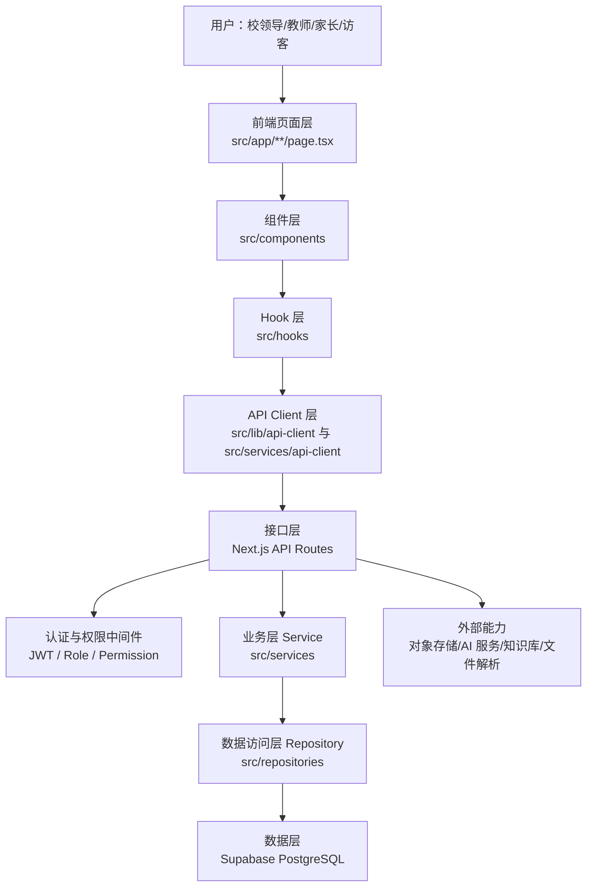
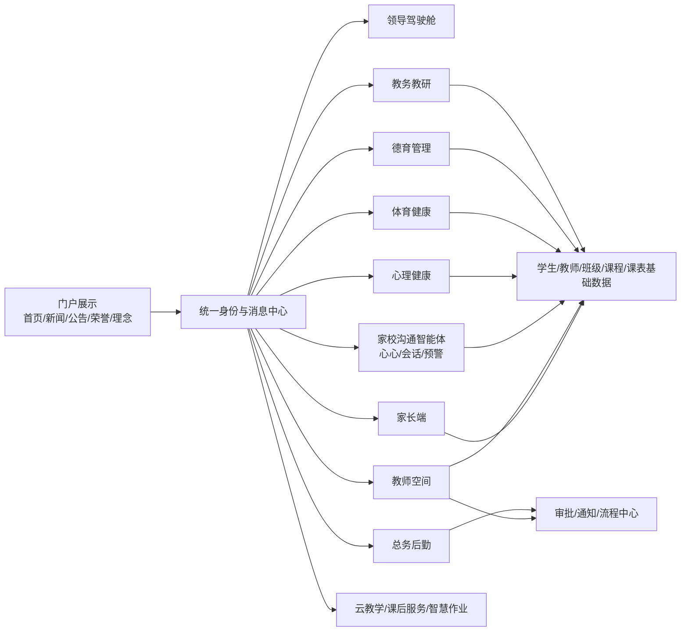
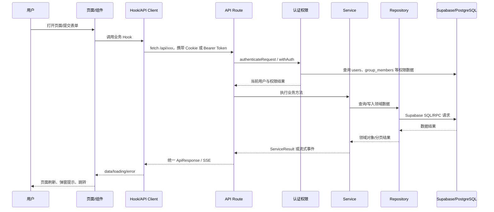
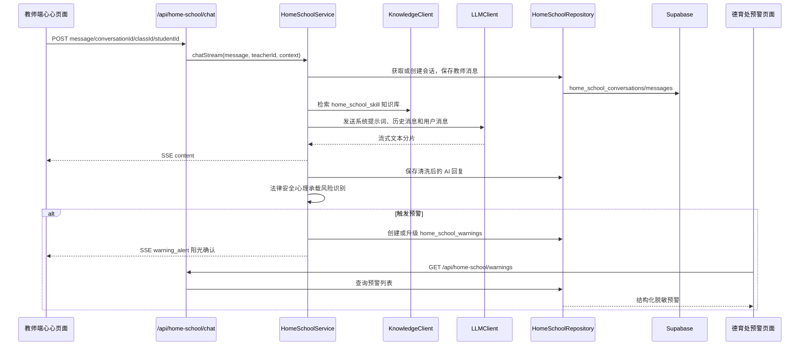
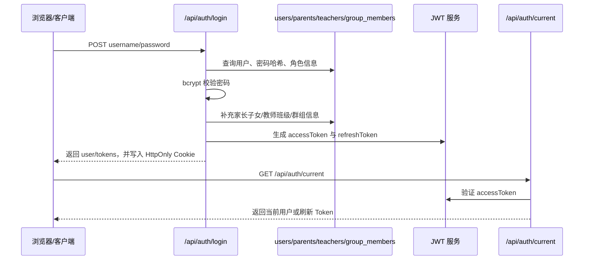
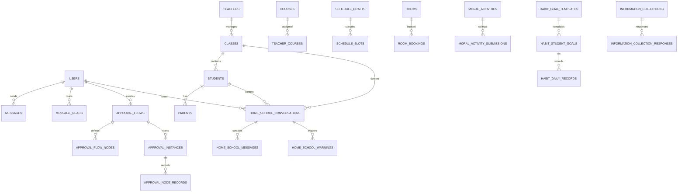

# 龙岩师范附属小学智慧校园系统详细设计说明书

> 文档依据：`lycllxb0314/test1` 仓库 `main` 分支源码快照，已包含 PR #1 `Home school agent` 合并后的家校沟通智能体“心心”模块。  
> 面向对象：产品、客户、实施、研发、测试与运维团队。  
> 说明：本文描述当前代码已体现的系统设计。部分模块已有完整 Service/Repository 分层，部分接口仍保留直接调用 Supabase 或 Mock 兼容逻辑，文档中按当前实现如实标注。

## 1. 系统概述

本系统是一套面向小学场景的智慧校园综合管理平台，覆盖学校门户、统一身份认证、校领导驾驶舱、总务后勤、教务教研、德育管理、体育健康、心理健康、家校沟通智能体、教师空间、家长端、云教学、课后服务、智慧作业、审批与消息通知等业务。

系统采用 Next.js App Router 作为前后端一体化框架：前端页面位于 `src/app/**/page.tsx`，后端接口位于 `src/app/api/**/route.ts`，业务逻辑由 `src/services` 承载，数据访问由 `src/repositories` 与 Supabase 客户端封装。数据库结构以 Drizzle PostgreSQL schema 描述，实际运行以 Supabase/PostgreSQL 为数据底座；部分 AI/智能体模块通过 Repository 直接访问 Supabase 表。

系统的核心建设方向是：以学生成长为主线，以教师工作减负和学校治理提效为支撑，以 AI 智能体和数据联动为特色，形成覆盖“学生、教师、家长、管理者”的未来智慧校园基础。

## 2. 技术选型清单

| 类别 | 技术/依赖 | 当前用途 |
| --- | --- | --- |
| 全栈框架 | Next.js App Router | 页面路由、API Routes、服务端/客户端混合渲染 |
| 前端框架 | React、TypeScript | 组件化页面、状态管理、类型约束 |
| UI 与样式 | Tailwind CSS、shadcn/ui、Radix UI、lucide-react | 页面布局、表单、弹窗、导航、图标 |
| 数据库 | Supabase PostgreSQL | 用户、学生、教师、班级、审批、健康、德育、智能体会话等业务数据 |
| ORM/Schema | Drizzle ORM、drizzle-kit | PostgreSQL 表结构声明、关系声明、类型辅助 |
| 认证安全 | jose、bcryptjs | JWT 签发/验证、密码哈希、登录认证 |
| 表单校验 | react-hook-form、zod | 表单状态、字段校验 |
| 图表 | Recharts | 统计看板、趋势图、健康/心理/业务分析 |
| 文件处理 | docx、mammoth、xlsx、pdf-parse、jspdf、html2canvas | Word/Excel/PDF 解析、导出、预览 |
| 视频播放 | hls.js | 云课程/直播课程播放 |
| AI/知识库 | coze-coding-dev-sdk、LLMClient、KnowledgeClient | 心理健康对话、家校沟通智能体“心心”、备课、智慧作业、课后服务 AI |
| 存储 | @aws-sdk/client-s3、@aws-sdk/lib-storage | 文件上传、对象存储集成 |
| 安全/体验 | DOMPurify、限流、缓存、Circuit Breaker | 富文本净化、登录限流、接口缓存和降级 |
| 包管理 | pnpm | 依赖安装与脚本运行 |

## 3. 系统整体架构

### 3.1 整体分层架构



| 分层 | 目录 | 主要职责 |
| --- | --- | --- |
| 前端层 | `src/app`、`src/components` | 页面组织、导航、表单、看板、列表、弹窗、文件预览、业务交互 |
| Hook/API Client 层 | `src/hooks`、`src/services/api-client` | 请求封装、缓存、loading/error 状态、前端业务数据组织 |
| 接口层 | `src/app/api`、`src/lib/api.ts` | REST API、SSE、请求解析、响应封装、限流、错误处理、权限校验 |
| 业务层 | `src/services` | 业务规则、流程编排、AI 调用、数据转换、通知触发、跨模块协同 |
| 数据层 | `src/repositories`、`src/storage/database` | Supabase 查询、CRUD、分页、筛选、索引/表关系定义 |

### 3.2 模块拆分架构



| 一级模块 | 二级模块/页面 | 主要路由 |
| --- | --- | --- |
| 学校门户 | 首页、新闻、公告、办学理念、成果荣誉、附小少年、教师风采 | `/`、`/news`、`/notices`、`/philosophy`、`/achievements` |
| 统一认证 | 登录、当前用户、登出、Token 刷新 | `/login`、`/api/auth/*` |
| 领导驾驶舱 | 校长、书记、教学副校长、德育副校长、总务副校长看板 | `/dashboard/*` |
| 总务后勤 | 资产、设备、报修、采购、财务、安全、门禁、环境、人员 | `/general/*` |
| 教务教研 | 学生、家长、新生注册、教师、班级、排课、工作量、考试、教室、教研、云教学、课后服务 | `/academic/*` |
| 德育管理 | 习惯养成、德育活动、学生荣誉、班级常规、云教学管理、家校沟通预警、心心会话记录 | `/moral/*` |
| 体育健康 | 体质体检、锻炼打卡、健康画像、健康处方、家长观察、周期报告 | `/health/*` |
| 心理健康 | 心理概览、预警、授权密钥、会话记录 | `/mental-health/*` |
| 家校沟通智能体 | 心心教师端、德育处会话查看、家校风险预警 | `/teacher/xinxin`、`/moral/xinxin-conversations`、`/moral/xinxin-warnings` |
| 教师空间 | 工作台、心心、档案、课表、备课、智慧作业、教研、课后服务、班级管理、SOP 台账 | `/teacher/*` |
| 家长端 | 工作台、暖心童童、体育健康、云教学、课后选课、荣誉申报、信息收集、习惯打卡、通知 | `/parent/*` |
| 审批与通知 | 审批流程、审批实例、消息、公告、群组 | `/api/approvals`、`/api/messages`、`/api/users/*` |

### 3.3 数据流走向图



### 3.4 家校沟通智能体“心心”数据流



### 3.5 权限架构与登录鉴权流程

系统采用“主要角色 + 兼任职务 + 群组权限”的合并权限模型。

| 权限来源 | 示例 | 作用 |
| --- | --- | --- |
| 主要角色 `UserRole` | 校长、书记、教学副校长、德育副校长、总务副校长、班主任、科任教师、家长 | 决定登录身份与基础模块权限 |
| 兼任职务 `AdministrativeRole` | 教务主任、德育主任、总务主任、年段长、教研组长、少先队辅导员 | 在主要角色之外增加模块权限 |
| 群组权限 `GroupMembership` | 教务组、德育组、总务组、年级组、教研组 | 按组织/群组继承权限 |
| 具体权限 `Permission` | `view`、`edit`、`approve`、`manage`、`admin` | 控制页面和接口操作粒度 |

主要模块类型包括：`general`、`academic`、`moral`、`health`、`mental`、`teacher`、`parent`。家校沟通智能体“心心”的教师端入口归属教师空间；德育处的会话记录与预警管理入口归属德育管理。

登录鉴权流程：



接口认证优先级：

1. `Authorization: Bearer <accessToken>`，用于小程序/H5/现代客户端。
2. Cookie 中的 `smart_campus_access_token`，用于浏览器端。
3. 兼容旧版 `x-user-id`、`userId` query、`smart_campus_user_id` Cookie。

## 4. 功能模块详细设计

### 4.1 学校门户

| 二级模块 | 业务逻辑 | 页面/交互 |
| --- | --- | --- |
| 首页轮播/图文区块 | 从门户配置、轮播、新闻、荣誉等表读取展示内容 | 首页首屏展示学校品牌、轮播图、新闻、办学理念、快捷入口 |
| 新闻公告 | 列表查询、详情查看、按发布状态展示 | `/news`、`/news/[id]`、`/notices`、`/notices/[id]` |
| 办学理念 | 展示理念分类和活动内容 | `/philosophy`、`/philosophy/[id]` |
| 成果荣誉 | 分类展示学校成果、荣誉、学生风采 | `/achievements`、`/student-showcase` |
| 门户后台 | 管理轮播、公告、理念、成果、教师风采 | `/admin/carousel`、`/api/admin/portal/*`、`/api/portal/*` |

### 4.2 教务教研

| 二级模块 | 业务逻辑 | 页面/交互 |
| --- | --- | --- |
| 学生管理 | 学生列表、详情、完整档案、批量更新/删除、班级/年级/状态筛选 | `/academic/students`、`/api/students` |
| 家长管理 | 家长列表、账号关联、子女关系、密码变更、批量操作 | `/academic/parents`、`/api/parents/*` |
| 新生注册 | 新生信息采集、家长端提交、教务端审核/注册 | `/academic/enrollment`、`/parent/enrollment`、`/api/enrollment` |
| 教师管理 | 教师档案、任教班级、可任教学科/年级、角色/兼任职务 | `/academic/teachers`、`/api/teachers/*` |
| 班级管理 | 班级基础信息、班主任、科任教师、学生清单 | `/academic/classes`、`/api/classes/*` |
| 手动排课/课表 | 年级草稿、节次编辑、发布正式课表、全校课表查看 | `/academic/manual-schedule/*`、`/academic/school-schedule` |
| 教室管理 | 教室资源、预约、审批、冲突检查、统计 | `/academic/rooms`、`/api/academic/rooms/*` |
| 教研活动 | 课题、阶段、活动、资源、成果、统计 | `/academic/research`、`/api/research/*` |
| 考试管理 | 考试创建、编辑、状态管理、试卷任务导出 | `/academic/exams`、`/api/exams`、`/api/exam-tasks` |
| 工作量统计 | 课表、请假、调课、代课汇总教师周工作量 | `/academic/workload`、`/api/workload` |
| 云教学管理 | 课程、直播、学习进度、评论、推送目标 | `/academic/cloud-course`、`/api/cloud-course/*` |
| 课后服务 | 课程申请、审核、报名、点名册、AI 评语 | `/academic/after-school`、`/api/after-school/*` |

页面跳转规则：教务首页进入各管理页面；列表页进入详情/编辑页或弹窗；排课按年级进入 `/academic/manual-schedule/[grade]`，发布后进入全校课表总览；教师/学生/班级关系变化会影响教师端课表、班级管理、年级管理等入口可见性。

### 4.3 德育管理

| 二级模块 | 业务逻辑 | 页面/交互 |
| --- | --- | --- |
| 习惯养成 | 目标模板、月度目标、学生目标、每日打卡、班级/学校统计 | `/moral/habit`、`/teacher/habit`、`/parent/habit` |
| 德育活动 | 德育处发布活动，班主任/年段长提交材料，德育处审核 | `/moral/activities`、`/teacher/activities` |
| 学生荣誉 | 荣誉活动、申报、审批、撤回、统计展示 | `/moral/honors`、`/parent/honor-application` |
| 班级常规 | 班级常规评分、值日管理、班级排名 | `/moral/routine`、`/api/routine-scores` |
| 云教学管理 | 面向家长/学生推送德育课程 | `/moral/cloud-course` |
| 家校沟通管理 | 查看“心心”会话记录、家校风险预警、处理备注与处置闭环 | `/moral/xinxin-conversations`、`/moral/xinxin-warnings` |

交互规则：德育活动支持草稿、发布、归档；荣誉申报支持家长提交、教师/德育审批、撤回；习惯目标以“模板 + 学生月目标 + 日记录”承载；家校沟通预警由德育处查看、研判、处理和留痕。

### 4.4 总务后勤

| 二级模块 | 业务逻辑 | 页面/交互 |
| --- | --- | --- |
| 资产管理 | 资产登记、状态、位置、责任人、统计 | `/general/assets`、`/api/general/assets` |
| 设备管理 | 设备列表、楼宇筛选、状态统计、控制指令 | `/general/devices`、`/api/general/devices/*` |
| 报修管理 | 教师报修、总务派修/处理、状态统计 | `/general/repairs`、`/teacher/repair` |
| 采购管理 | 采购申请、审批、统计 | `/general/purchase`、`/teacher/purchase` |
| 财务报销 | 报销申请、审批、统计 | `/general/finance`、`/teacher/expense` |
| 安全管理 | 演练、巡检、隐患处理、统计 | `/general/security`、`/api/safety/*` |
| 门禁管理 | 通行人员、申请、记录、统计 | `/general/access`、`/visitor-apply`、`/api/access/*` |
| 环境/人员 | 环境、绿化、后勤人员维护 | `/general/environment`、`/general/staff` |

### 4.5 教师空间

| 二级模块 | 业务逻辑 | 页面/交互 |
| --- | --- | --- |
| 工作台/档案 | 展示个人信息、角色权限、待办、课表、通知 | `/teacher`、`/teacher/profile` |
| 我的课表 | 根据教师工号、课表槽位、调课结果展示个人课程 | `/teacher/schedule` |
| 请假调课 | 教师提交请假；需要调课时联动调课建议、审批和课表同步 | `/teacher/leave`、`/teacher/adjust` |
| 备课中心 | 语文/数学备课、文本解析、生成内容 | `/teacher/lesson-prep`、`/api/lesson-prep` |
| 智慧作业 | 题库、试卷、命题对话、规范排版 | `/teacher/smart-homework`、`/api/smart-homework/*` |
| 心心家校沟通智能体 | 面向教师提供家校沟通情绪承托、现象破译、沟通支架、话术防线检查、会话留痕和预警触发 | `/teacher/xinxin`、`/api/home-school/*` |
| 班级管理 | 班主任/科任查看学生家长、座位、荣誉、德育、信息收集 | `/teacher/class`、`/teacher/collection` |
| 班级 SOP | 模板、执行、步骤、台账、上传 | `/teacher/class-sop`、`/api/class-sop/*` |
| 教室预约/报修/采购/报销 | 教师发起后勤类申请，进入总务处理或审批流程 | `/teacher/room-booking`、`/teacher/repair`、`/teacher/purchase`、`/teacher/expense` |

### 4.6 家长端

| 二级模块 | 业务逻辑 | 页面/交互 |
| --- | --- | --- |
| 工作台/子女信息 | 根据家长手机号关联 `parents` 与学生 | `/parent`、`/parent/children` |
| 暖心童童 | 家长/学生心理陪伴对话入口 | `/parent/tongtong`、`/api/mental-health/chat` |
| 体育健康 | 查看孩子健康画像、处方、家长观察提交 | `/parent/health` |
| 云教学 | 家长课程、子女学习进度 | `/parent/cloud-course` |
| 课后选课 | 家长为子女报名课后服务，支持退选 | `/parent/after-school` |
| 荣誉申报 | 家长为孩子提交荣誉申请、查看审批状态 | `/parent/honor-application` |
| 信息收集 | 填写班主任发布的表单 | `/parent/collection` |
| 习惯打卡 | 按学生目标进行每日打卡、照片和说明提交 | `/parent/habit` |
| 成绩/公告/新生注册 | 查看成绩、通知公告、提交新生信息 | `/parent/grades`、`/parent/announcements`、`/parent/enrollment` |

### 4.7 家校沟通智能体“心心”

| 二级模块 | 业务逻辑 | 页面/接口 |
| --- | --- | --- |
| 教师端对话 | 教师输入家长沟通难题或沟通草稿，系统通过 SSE 流式返回“心心”的分析、追问、策略和话术建议 | `/teacher/xinxin`、`/api/home-school/chat` |
| 会话管理 | 按教师、班级、学生、沟通场景创建会话；保存用户消息与 AI 回复；默认取最近 20 条消息作为上下文 | `/api/home-school/conversations` |
| 知识库增强 | 调用 `KnowledgeClient.search` 检索 `home_school_skill` 知识库，将家校沟通专业知识拼入系统提示词 | `src/services/home-school.service.ts` |
| 德育处会话查看 | 德育处可查看全校教师与“心心”的会话记录，并按教师、班级、学生、标题进行检索 | `/moral/xinxin-conversations` |
| 家校沟通预警 | 对法律安全红线与教师心理承载红线进行识别，生成高危/中危预警 | `/moral/xinxin-warnings`、`/api/home-school/warnings` |
| 预警处置闭环 | 德育处查看预警关联会话，填写处理备注，记录处理人、处理时间和处理状态 | `/api/home-school/warnings` |

“心心”的核心设计不是简单的回复生成，而是“承托、破译、拼图、支架、防线、复盘”的家校沟通专业流程：

1. 情绪承托：先接住教师面对家校冲突时的委屈、焦虑和压力。
2. 现象破译：将家长的指责性表达转译为背后的担忧、诉求和边界问题。
3. 全景拼图：引导教师结合德育、教务、体质、日常观察等学生整体信息，不基于单点冲突直接给话术。
4. 沟通支架：生成同频共振、事实锚定、边界重构的沟通策略和参考话术。
5. 防线检查：检查定性评价、过度承诺、越界指导、泄露其他学生隐私等风险点。
6. 实战复盘：沉淀家校沟通经验和后续教育动作建议。

预警机制采用“三层无感预警”：

| 层级 | 作用 | 说明 |
| --- | --- | --- |
| 第一层 | 无感测温 | 从教师输入和 AI 输出中捕捉风险因子 |
| 第二层 | 脱敏折叠 | 上报客观风险实体，折叠教师主观情绪、吐槽和拟定话术 |
| 第三层 | 阳光确认 | 预警触发后返回 `warning_alert` 事件，让教师知晓系统已完成脱敏预警 |

当前识别的预警类型包括：

- `legal_safety`：法律与安全红线，如极端投诉、威胁、暴力、自伤自残等。
- `psychological`：教师心理承载红线，如崩溃、职业倦怠、强烈离职倾向等。

### 4.8 体育健康与心理健康

| 模块 | 业务逻辑 | 页面/接口 |
| --- | --- | --- |
| 体育健康 | 体测、锻炼、健康画像、健康处方、家长观察、周期报告 | `/health/*`、`/api/health/*` |
| 心理健康 | 授权密钥、学生会话、敏感预警、预警处理 | `/mental-health/*`、`/teacher/mental-health`、`/api/mental-health/*` |

心理健康模块强调授权控制：班主任查看本班学生心理状态需要授权密钥，德育/校领导侧可查看预警与会话统计。

## 5. 数据库设计

### 5.1 整体库表结构说明

数据库按业务域拆分，核心表主要来自 `src/storage/database/shared/schema.ts`；部分新增 AI/智能体模块（如家校沟通“心心”）通过 Repository 直接访问 Supabase 表，本文按当前代码实际访问的表结构一并说明。

| 业务域 | 核心表 |
| --- | --- |
| 学校基础 | `schools`、`users`、`teachers`、`students`、`parents`、`classes`、`group_members` |
| 教务排课 | `courses`、`teacher_courses`、`semesters`、`daily_schedules`、`schedule_drafts`、`schedule_slots`、`teacher_workload`、`course_adjustments`、`leave_requests` |
| 考试成绩 | `exams`、`grades`、`exam_tasks` 相关 Repository |
| 考勤 | `student_attendance`、`teacher_attendance` |
| 审批流程 | `workflow_configs`、`workflow_instances`、`approval_records`、`approval_flows`、`approval_flow_nodes`、`approval_instances`、`approval_node_records` |
| 门户内容 | `homepage_news`、`homepage_images`、`homepage_sections`、`homepage_honors`、`carousel_items`、`announcements`、`achievements`、`achievement_categories` |
| 消息通知 | `messages`、`message_reads` |
| 德育习惯 | `moral_activities`、`moral_activity_submissions`、`habit_goal_templates`、`habit_student_goals`、`habit_daily_records`、`habit_stars`、`routine_scores` |
| 家校采集 | `information_collections`、`information_collection_responses` |
| 家校沟通智能体 | `home_school_conversations`、`home_school_messages`、`home_school_warnings` |
| 总务后勤 | `assets`、`rooms`、`room_bookings`、`duty_teachers` 及设备/报修/采购/费用相关 Repository |
| 教研 | `research_themes`、`research_schemes`、`research_stages`、`research_activities`、`research_participations`、`research_resources`、`research_achievements` |
| 云教学/课后服务 | `cloud_courses`、`course_enrollments`、`learning_records`、`live_sessions`、`after_school_courses` 等业务表 |

### 5.2 核心数据表字段、类型、注释

#### users 用户表

| 字段 | 类型 | 注释 |
| --- | --- | --- |
| `id` | uuid PK | 用户主键 |
| `employee_id` | varchar(50), unique | 工号/账号标识 |
| `name` | varchar(100) | 姓名 |
| `role` | varchar(50) | 主要角色 |
| `additional_roles` | text[] | 兼任职务 |
| `phone`、`email` | varchar | 联系方式 |
| `department`、`position` | varchar | 部门与岗位 |
| `class_id`、`class_name` | varchar | 关联班级 |
| `subjects` | text[] | 任教学科 |
| `children` | jsonb | 家长关联子女缓存 |
| `password_hash` | varchar(255) | bcrypt 密码哈希 |
| `status` | varchar(20) | 用户状态 |
| `managed_grades` | integer[] | 可管理年级 |

索引：`employee_id`、`role`、`status`、`class_id`。

#### teachers 教师表

| 字段 | 类型 | 注释 |
| --- | --- | --- |
| `id` | varchar(50) PK | 教师主键 |
| `employee_id` | varchar(50) | 工号 |
| `name` | varchar(50) | 姓名 |
| `subjects` | jsonb | 任教学科 |
| `is_head_teacher` | boolean | 是否班主任 |
| `head_teacher_class_ids` | jsonb | 班主任班级 |
| `department`、`title` | varchar | 部门、职称 |
| `role` | varchar(50) | 教师角色 |
| `primary_subject` | varchar(50) | 主教学科 |
| `teachable_grades` | jsonb | 可任教年级 |
| `additional_roles` | jsonb | 兼任职务 |
| `teaching_classes` | jsonb | 任教班级 |
| `managed_grades` | integer[] | 管理年级 |

#### students 学生表

| 字段 | 类型 | 注释 |
| --- | --- | --- |
| `id` | varchar(50) PK | 学生主键 |
| `student_no` | varchar(50), unique | 学号 |
| `name` | varchar(50) | 姓名 |
| `gender`、`birth_date` | varchar | 性别、出生日期 |
| `class_id`、`class_name` | varchar | 所在班级 |
| `grade` | integer | 年级 |
| `parent_name`、`parent_phone` | varchar | 主要家长 |
| `parents` | jsonb | 多家长信息 |
| `status` | varchar(20) | `在校` 等状态 |
| `emergency_contact`、`emergency_phone` | varchar | 紧急联系人 |

索引：`class_id`、`grade`、`status`；唯一约束：`student_no`。

#### classes 班级表

| 字段 | 类型 | 注释 |
| --- | --- | --- |
| `id` | varchar(50) PK | 班级主键 |
| `name` | varchar(50) | 班级名称 |
| `grade`、`grade_name` | integer/varchar | 年级 |
| `class_number` | integer | 班级序号 |
| `head_teacher_id`、`head_teacher_name` | varchar | 班主任 |
| `subject_teachers` | jsonb | 科任教师清单 |
| `student_count` | integer | 学生数 |
| `classroom_id`、`classroom_name` | varchar | 教室 |
| `status` | varchar(20) | 状态 |

#### parents 家长表

| 字段 | 类型 | 注释 |
| --- | --- | --- |
| `id` | varchar(50) PK | 家长记录主键 |
| `student_id`、`student_name` | varchar | 关联学生 |
| `class_id`、`class_name` | varchar | 学生班级 |
| `name` | varchar(50) | 家长姓名 |
| `relation`、`relation_name` | varchar | 关系 |
| `phone`、`wechat` | varchar | 联系方式 |
| `is_primary` | boolean | 是否主联系人 |
| `has_account`、`account_id` | boolean/varchar | 是否开通账号 |
| `notify_settings` | jsonb | 通知偏好 |

#### home_school_conversations / home_school_messages / home_school_warnings 家校沟通智能体

该组表由 `home-school.repository.ts` 通过 Supabase 客户端直接访问，用于支撑教师端“心心”家校沟通智能体、德育处会话查看和家校风险预警。

| 表 | 关键字段 | 注释 |
| --- | --- | --- |
| `home_school_conversations` | `id`、`teacher_id`、`class_id`、`title`、`student_id`、`student_name`、`context_type`、`emotion_level`、`teacher_deleted`、`created_at`、`updated_at` | 家校沟通会话；按教师、班级、学生、沟通场景记录对话上下文 |
| `home_school_messages` | `id`、`conversation_id`、`role`、`content`、`teacher_deleted`、`created_at` | 会话消息；`role` 为教师输入或 AI 回复；支持教师端软删除隐藏 |
| `home_school_warnings` | `id`、`conversation_id`、`teacher_id`、`teacher_name`、`class_id`、`class_name`、`student_id`、`student_name`、`risk_level`、`trigger_type`、`trigger_summary`、`recommendation`、`is_handled`、`handler_id`、`handler_name`、`handle_note`、`handled_at`、`created_at`、`updated_at` | 家校沟通预警；保存脱敏后的结构化风险、处置建议和德育处处理记录 |

关系：

- `home_school_messages.conversation_id -> home_school_conversations.id`
- `home_school_warnings.conversation_id -> home_school_conversations.id`
- `home_school_conversations.teacher_id`、`home_school_warnings.teacher_id` 逻辑关联 `users.id`
- `class_id`、`student_id` 分别逻辑关联班级与学生数据

#### approval_flows / approval_instances 审批流程

| 表 | 关键字段 | 注释 |
| --- | --- | --- |
| `approval_flows` | `name`、`type`、`department`、`is_active`、`created_by` | 流程定义 |
| `approval_flow_nodes` | `flow_id`、`node_type`、`node_order`、`approver_type`、`approver_roles` | 流程节点 |
| `approval_instances` | `flow_id`、`business_type`、`business_id`、`status`、`current_node_order` | 业务审批实例 |
| `approval_node_records` | `instance_id`、`status`、`approver_ids`、`action`、`comment` | 节点审批记录 |

#### room_bookings / rooms 教室预约

| 表 | 关键字段 | 注释 |
| --- | --- | --- |
| `rooms` | `id`、`name`、`building`、`capacity`、`type`、`facilities`、`status` | 教室资源 |
| `room_bookings` | `room_id`、`applicant_id`、`booking_date`、`start_time`、`end_time`、`status`、`approval_flow` | 预约申请与审批状态 |

#### habit / moral 德育习惯

| 表 | 关键字段 | 注释 |
| --- | --- | --- |
| `moral_activities` | `title`、`target_grades`、`target_roles`、`require_submission`、`status` | 德育活动 |
| `moral_activity_submissions` | `activity_id`、`class_id`、`submitter_id`、`status` | 班级活动提交 |
| `habit_goal_templates` | `category`、`code`、`title`、`grade_range`、`difficulty` | 习惯目标模板 |
| `habit_student_goals` | `class_id`、`student_id`、`month`、`goal_template_id`、`approval_status` | 学生月目标 |
| `habit_daily_records` | `student_goal_id`、`student_id`、`check_date`、`status`、`photo_url` | 每日打卡 |

### 5.3 主键、外键、索引设计

| 类型 | 当前设计 |
| --- | --- |
| 主键 | 混合使用 `uuid`、`serial`、`varchar(50)`。新审批、消息、课表多用 `uuid`；部分老业务表用业务字符串 ID。 |
| 外键 | Drizzle 中已声明审批、消息、课表草稿、课程、门户分类、习惯目标、德育提交、信息采集、教室预约等关键外键。家校沟通智能体相关表当前由 Supabase 直接访问，文档按逻辑关系说明。 |
| 逻辑关联 | 学生/教师/班级、家长/学生、家校会话/教师/班级/学生等大量字段使用 `varchar` 或 `uuid` 逻辑关联，便于兼容历史数据和外部导入。 |
| 索引 | 高频查询字段均有索引：角色、状态、年级、班级、教师、日期、流程状态、消息收发人、审批业务标识等。建议为 `home_school_conversations.teacher_id`、`home_school_messages.conversation_id`、`home_school_warnings.conversation_id/is_handled/risk_level` 建立索引。 |
| 唯一约束 | `users.employee_id`、`students.student_no`、`schedule_drafts.grade`、`teacher_workload(employee_id, academic_year, semester, week_number)`、习惯每日记录等。 |

### 5.4 数据字典与枚举值

| 枚举 | 值 | 说明 |
| --- | --- | --- |
| `UserRole` | `principal`、`secretary`、`academic_vice_principal`、`moral_vice_principal`、`general_vice_principal`、`head_teacher`、`subject_teacher`、`skill_teacher`、`parent` | 主要登录角色 |
| `AdministrativeRole` | `academic_director`、`moral_director`、`general_director`、`grade_leader`、`research_group_leader`、`young_pioneer_counselor` | 兼任职务 |
| `Permission` | `view`、`edit`、`approve`、`manage`、`admin` | 权限级别 |
| `ModuleType` | `general`、`academic`、`moral`、`health`、`mental`、`teacher`、`parent` | 模块权限域 |
| `HomeSchoolContextType` | `general`、`learning`、`behavior`、`attendance`、`health`、`activity`、`grade`、`discipline` | 家校沟通场景：日常、学习、行为、出勤、健康、活动、成绩、违纪 |
| `HomeSchoolEmotionLevel` | `positive`、`neutral`、`concern`、`alert` | 家校沟通会话情绪等级 |
| `HomeSchoolWarningRiskLevel` | `high`、`medium` | 家校沟通预警风险等级 |
| `HomeSchoolWarningTriggerType` | `legal_safety`、`psychological` | 法律安全红线、教师心理承载红线 |
| 课程类型 | `required`、`elective`、`activity` | 必修、选修、活动 |
| 调课状态 | `pending`、`approved`、`rejected`、`completed` | 待审、通过、驳回、完成 |
| 请假状态 | `draft`、`pending`、`approved`、`rejected`、`returned`、`cancelled` | 草稿、待审、通过、驳回、退回、取消 |
| 德育活动状态 | `draft`、`published`、`archived` | 草稿、已发布、归档 |
| 德育提交状态 | `pending`、`submitted`、`reviewed`、`rejected` | 待提交、已提交、已审核、驳回 |

### 5.5 数据表关系 ER 图



## 6. 接口文档

### 6.1 通用规范

接口统一返回结构：

```json
{
  "success": true,
  "data": {},
  "message": "ok",
  "source": "database",
  "pagination": {
    "page": 1,
    "pageSize": 20,
    "total": 100
  }
}
```

通用约定：

- 需要登录的接口调用 `authenticateRequest` 或 `withAuth` 获取当前用户。
- 列表接口通常支持分页、搜索、状态筛选。
- 写操作失败返回统一错误码与错误消息。
- SSE 接口用于 AI 流式输出，如心理健康对话、家校沟通“心心”等。

### 6.2 认证接口

| 方法 | 路径 | 说明 |
| --- | --- | --- |
| POST | `/api/auth/login` | 登录，返回用户信息与 Token |
| POST | `/api/auth/logout` | 登出 |
| GET | `/api/auth/current` | 获取当前登录用户 |
| POST | `/api/auth/refresh` | 刷新 Token |
| GET | `/api/health` | 系统健康检查 |
| GET | `/api/debug/auth` | 认证调试 |

### 6.3 教务基础数据接口

| 方法 | 路径 | 说明 |
| --- | --- | --- |
| GET/POST/DELETE | `/api/students` | 学生列表、创建、批量删除 |
| GET/PATCH/DELETE | `/api/students/[id]` | 学生详情、更新、删除 |
| GET | `/api/students/[id]/full-profile` | 学生完整档案 |
| POST | `/api/students/batch-update` | 批量更新学生 |
| GET/POST | `/api/teachers` | 教师列表、创建 |
| GET/PATCH/DELETE | `/api/teachers/[id]` | 教师详情、更新、删除 |
| GET | `/api/teachers/[id]/profile` | 教师档案 |
| GET | `/api/teachers/[id]/full-profile` | 教师完整档案 |
| GET | `/api/teachers/available` | 可用教师列表 |
| GET | `/api/teachers/workload` | 教师工作量 |
| GET | `/api/classes` | 班级列表 |
| GET/PUT/DELETE | `/api/classes/[id]` | 班级详情、更新、删除 |
| GET | `/api/classes/[id]/students` | 班级学生 |
| GET | `/api/courses` | 课程列表 |
| GET | `/api/parents` | 家长列表 |
| GET/PUT/DELETE | `/api/parents/[id]` | 家长详情、更新、删除 |
| POST | `/api/parents/batch` | 家长批量处理 |

### 6.4 排课、课表、考勤与工作量接口

| 方法 | 路径 | 说明 |
| --- | --- | --- |
| GET/POST | `/api/academic/manual-schedule/draft` | 获取/保存手动排课草稿 |
| GET | `/api/academic/manual-schedule/grade` | 获取年级排课数据 |
| GET/POST/DELETE | `/api/academic/manual-schedule/slot` | 查询/新增/删除节次 |
| POST | `/api/academic/manual-schedule/publish` | 发布排课结果 |
| GET/PUT | `/api/academic/official-schedule` | 正式课表查询/更新 |
| GET | `/api/academic/school-schedule` | 全校课表 |
| GET/POST | `/api/schedules` | 课表数据 |
| GET | `/api/schedule/weekly` | 周课表 |
| GET/POST | `/api/attendance` | 学生考勤 |
| GET | `/api/teacher/schedule` | 当前教师课表 |
| GET/POST/PUT | `/api/leave-requests-v2` | 请假申请列表/提交/更新 |
| POST | `/api/leave-requests-v2/[id]/approve` | 请假审批 |
| GET/POST | `/api/course-adjustments/process` | 调课处理 |
| GET | `/api/course-adjustments/recommend-teachers` | 推荐代课教师 |

### 6.5 总务、资产、安全与审批接口

| 方法 | 路径 | 说明 |
| --- | --- | --- |
| GET/POST/PUT | `/api/academic/rooms` | 教室资源管理 |
| GET/POST | `/api/academic/rooms/bookings` | 教室预约 |
| GET/POST | `/api/general/assets` | 资产列表/新增 |
| GET/POST | `/api/general/devices` | 设备列表/新增 |
| POST | `/api/general/devices/control` | 设备控制 |
| GET/POST | `/api/general/repairs` | 报修列表/新增 |
| GET/POST | `/api/general/purchase` | 采购申请 |
| GET/POST | `/api/expense-reimbursements` | 报销申请 |
| GET/POST | `/api/safety/drills` | 安全演练 |
| GET/POST | `/api/safety/inspections` | 安全巡检 |
| GET/POST | `/api/access/persons` | 门禁人员 |
| GET/POST | `/api/access/records` | 通行记录 |
| GET/POST | `/api/access/applications` | 门禁申请 |
| GET/POST | `/api/approval-flows` | 审批流程 |
| GET/POST | `/api/approval-instances` | 审批实例 |
| POST | `/api/approvals/[id]/approve` | 审批通过 |
| POST | `/api/approvals/[id]/reject` | 审批驳回 |

### 6.6 德育、习惯、荣誉、信息采集接口

| 方法 | 路径 | 说明 |
| --- | --- | --- |
| GET/POST | `/api/habit/goals` | 习惯目标 |
| GET/POST | `/api/habit/monthly-goals` | 月度目标 |
| GET/POST | `/api/habit/records` | 打卡记录 |
| GET | `/api/habit/statistics` | 习惯统计 |
| GET/POST | `/api/moral/activities` | 德育活动 |
| GET/POST | `/api/moral/activities/submissions` | 活动提交 |
| GET/POST | `/api/honor-campaigns` | 荣誉活动 |
| POST | `/api/honor-campaigns/[id]/publish` | 发布荣誉活动 |
| GET/POST | `/api/honor-applications` | 荣誉申报 |
| POST | `/api/honor-applications/[id]/approve` | 审批申报 |
| POST | `/api/honor-applications/[id]/withdraw` | 撤回申报 |
| GET/POST | `/api/information-collections` | 信息收集 |
| GET/POST | `/api/information-collections/[id]/responses` | 收集结果 |
| GET | `/api/information-collections/parent` | 家长待填收集 |

### 6.7 教研、备课、智慧作业、云教学接口

| 方法 | 路径 | 说明 |
| --- | --- | --- |
| GET/POST | `/api/research/themes` | 课题/主题 |
| GET/POST | `/api/research/stages` | 阶段 |
| GET/POST | `/api/research/activities` | 教研活动 |
| GET/POST/DELETE | `/api/research/resources` | 教研资源 |
| GET/POST | `/api/research/achievements` | 教研成果 |
| GET | `/api/research/statistics` | 教研统计 |
| GET/POST | `/api/lesson-prep` | 备课资源 |
| POST | `/api/lesson-prep/chat` | 备课对话 |
| GET/POST | `/api/teaching-resources` | 教学资源 |
| POST | `/api/teaching-resources/upload` | 教学资源上传 |
| GET/POST | `/api/smart-homework/papers` | 试卷 |
| POST | `/api/smart-homework/question-bank` | 题库写入 |
| POST | `/api/smart-homework/chat` | 智慧作业对话 |
| GET/POST/DELETE/PATCH | `/api/cloud-course/comments` | 课程评论 |
| GET/POST/PATCH/DELETE | `/api/cloud-course/courses`、`/api/cloud-course/courses/[id]` | 云课程 |
| GET/POST | `/api/cloud-course/enrollments` | 课程报名/学习关系 |
| GET/POST | `/api/cloud-course/learning` | 学习进度 |
| GET/POST | `/api/cloud-course/live` | 直播课 |
| POST | `/api/cloud-course/live/signal` | 直播信令 |
| GET/POST | `/api/cloud-course/push-targets` | 推送目标 |
| GET | `/api/cloud-course/stats` | 云课程统计 |

### 6.8 体育健康与心理健康接口

| 方法 | 路径 | 说明 |
| --- | --- | --- |
| GET | `/api/health/exercise` | 锻炼打卡 |
| GET/POST | `/api/health/fitness` | 体质体检 |
| GET/POST | `/api/health/observations` | 家长观察 |
| GET/POST | `/api/health/portraits` | 健康画像 |
| GET/POST/PATCH | `/api/health/prescriptions` | 健康处方 |
| GET | `/api/health/stats` | 健康统计 |
| GET/POST/DELETE | `/api/mental-health/auth-keys` | 心理健康授权密钥 |
| POST | `/api/mental-health/chat` | 心理对话 |
| GET | `/api/mental-health/children` | 可查看子女/学生 |
| POST | `/api/mental-health/face-verify` | 人脸/身份校验 |
| GET/DELETE | `/api/mental-health/sessions` | 会话记录 |
| GET | `/api/mental-health/stats` | 心理统计 |
| GET/POST/PATCH | `/api/mental-health/warnings` | 预警管理 |

### 6.9 家校沟通智能体“心心”接口

| 方法 | 路径 | 说明 |
| --- | --- | --- |
| POST | `/api/home-school/chat` | 教师端“心心”家校沟通对话；SSE 流式返回 `session`、`content`、`warning_alert`、`done` 事件 |
| GET | `/api/home-school/conversations` | 获取当前教师会话列表；不传 `all` 时按当前登录教师过滤 |
| GET | `/api/home-school/conversations?conversationId=xxx` | 获取会话详情与消息列表 |
| GET | `/api/home-school/conversations?all=true` | 德育处获取全校教师与“心心”的会话记录 |
| DELETE | `/api/home-school/conversations?conversationId=xxx` | 教师端软删除会话，仅隐藏教师端视图，后台记录和预警不受影响 |
| GET | `/api/home-school/warnings` | 获取家校沟通预警列表，支持 `isHandled`、`riskLevel` 过滤 |
| POST | `/api/home-school/warnings` | 处理家校沟通预警，写入处理人、处理备注和处理时间 |

`/api/home-school/chat` 请求体核心字段：

| 字段 | 类型 | 必填 | 说明 |
| --- | --- | --- | --- |
| `message` | string | 是 | 教师输入的家校沟通问题、家长原话或拟发送话术 |
| `conversationId` | string | 否 | 已有会话 ID，不传则创建新会话 |
| `classId` | string | 否 | 班级上下文 |
| `studentId` | string | 否 | 学生上下文 |
| `studentName` | string | 否 | 学生姓名，用于会话标题和预警摘要 |
| `contextType` | string | 否 | 沟通场景，如 `learning`、`behavior`、`health`、`discipline` |

SSE 事件：

| 事件 | 说明 |
| --- | --- |
| `session` | 返回 `conversationId` 和会话标题 |
| `content` | AI 回复文本分片 |
| `warning_alert` | 家校风险预警阳光确认，包含风险等级、触发类型、摘要和建议 |
| `done` | 流式输出完成 |

预警接口返回结构核心字段：

| 字段 | 类型 | 说明 |
| --- | --- | --- |
| `riskLevel` | `high`/`medium` | 风险等级 |
| `triggerType` | `legal_safety`/`psychological` | 触发类型 |
| `triggerSummary` | string | 脱敏后的结构化风险摘要 |
| `recommendation` | string | 德育处处置建议 |
| `isHandled` | boolean | 是否已处理 |
| `handlerName`、`handleNote`、`handledAt` | string | 处理人、处理备注、处理时间 |

### 6.10 家长、消息、门户与文件接口

| 方法 | 路径 | 说明 |
| --- | --- | --- |
| GET | `/api/parent/children` | 当前家长子女列表 |
| GET/PUT | `/api/parents/me` | 家长个人信息 |
| GET | `/api/parents/user/[id]/children` | 指定用户子女 |
| GET/POST | `/api/messages` | 消息列表/发送 |
| GET/PUT/DELETE | `/api/messages/[id]` | 消息详情/更新/删除 |
| POST | `/api/messages/read-all` | 全部已读 |
| GET | `/api/users/accounts` | 账号列表 |
| GET | `/api/users/approvers` | 审批人列表 |
| GET/PUT | `/api/users/[id]/groups` | 用户群组 |
| POST | `/api/users/change-password` | 用户改密 |
| GET/POST | `/api/portal/announcements` | 门户公告 |
| GET/POST | `/api/portal/carousel` | 轮播 |
| GET/POST | `/api/portal/achievements` | 成果 |
| GET | `/api/portal/achievements/categories` | 成果分类 |
| GET | `/api/portal/philosophy` | 办学理念 |
| GET | `/api/portal/honors` | 学校荣誉 |
| POST | `/api/upload` | 文件上传 |
| POST | `/api/upload-video` | 视频上传 |
| POST | `/api/parse-file` | 文件解析 |
| GET | `/api/download` | 文件下载 |
| POST | `/api/search-images` | 图片搜索 |

### 6.11 课后服务与其他专项接口

| 方法 | 路径 | 说明 |
| --- | --- | --- |
| GET/POST | `/api/after-school/courses` | 课后服务课程 |
| GET/PATCH/DELETE | `/api/after-school/courses/[id]` | 课程详情/更新/删除 |
| POST | `/api/after-school/courses/[id]/review` | 课程审核 |
| POST | `/api/after-school/courses/apply` | 教师申请开课 |
| GET | `/api/after-school/courses/pending` | 待审课程 |
| POST/DELETE | `/api/after-school/enroll` | 报名/退选 |
| GET | `/api/after-school/enrollments` | 报名记录 |
| GET | `/api/after-school/roster/[courseId]` | 点名册 |
| POST | `/api/after-school/ai` | 课后服务 AI 能力 |
| GET/POST | `/api/seating-plans` | 座位表 |
| GET/PUT/DELETE | `/api/seating-plans/[id]` | 座位表详情 |
| GET/POST | `/api/class-sop/templates` | SOP 模板 |
| GET/POST | `/api/class-sop/executions` | SOP 执行 |
| GET/POST | `/api/class-sop/ledger` | SOP 台账 |

## 7. 项目目录结构

```text
test1-main/
├── src/
│   ├── app/                         # Next.js App Router 页面与 API
│   │   ├── api/                     # 后端接口，包含认证、业务、AI、文件、home-school 等 API Routes
│   │   │   └── home-school/         # 心心聊天、会话、预警接口
│   │   ├── academic/                # 教务教研页面
│   │   ├── general/                 # 总务后勤页面
│   │   ├── moral/                   # 德育管理页面
│   │   │   ├── xinxin-conversations/ # 德育处查看心心会话记录
│   │   │   └── xinxin-warnings/      # 家校沟通预警管理
│   │   ├── health/                  # 体育健康页面
│   │   ├── mental-health/           # 心理健康页面
│   │   ├── teacher/                 # 教师空间页面
│   │   │   └── xinxin/              # 家校沟通智能体“心心”
│   │   ├── parent/                  # 家长端页面
│   │   ├── dashboard/               # 领导驾驶舱
│   │   ├── login/                   # 登录页
│   │   ├── page.tsx                 # 门户首页
│   │   └── layout.tsx               # 根布局
│   ├── components/                  # UI 与业务组件
│   │   ├── ui/                      # shadcn/ui 基础组件
│   │   ├── layout/                  # 主布局、侧边栏、导航配置
│   │   ├── auth/                    # 前端路由保护
│   │   ├── portal/                  # 门户组件
│   │   ├── cloud-course/            # 云教学组件
│   │   ├── health/                  # 健康组件
│   │   └── honors/                  # 荣誉组件
│   ├── contexts/                    # React Context，例如 AuthContext
│   ├── hooks/                       # 业务 Hook 与通用请求 Hook
│   │   └── useHomeSchool.ts         # 心心会话与家校预警 Hook
│   ├── lib/                         # API 工具、认证、缓存、DI、加密、限流等
│   │   ├── auth/                    # JWT、session、权限、中间件
│   │   ├── api-client/              # 前端 API Client
│   │   ├── di/                      # 依赖注入容器
│   │   └── api.ts                   # 统一响应/错误/分页工具
│   ├── repositories/                # 数据访问层
│   │   └── home-school.repository.ts # 家校沟通会话、消息、预警数据访问
│   ├── services/                    # 业务服务层
│   │   └── home-school.service.ts    # 心心智能体、知识库检索、三层预警
│   ├── storage/database/            # Supabase 客户端与 Drizzle schema/relations
│   ├── types/                       # 领域类型定义
│   │   └── home-school.ts           # 家校沟通智能体类型
│   ├── config/                      # 角色、习惯等配置
│   └── data/                        # Mock/静态数据
├── docs/                            # 架构、接口、审计与说明文档
├── scripts/                         # 构建、开发、API 文档生成、密码重置脚本
├── public/                          # 静态资源
├── assets/                          # 业务图片、文档资源
├── package.json                     # 依赖与脚本
├── next.config.ts                   # Next.js 配置
└── components.json                  # shadcn/ui 配置
```

## 8. 当前设计特点与交付建议

### 8.1 当前设计特点

- 功能覆盖面完整，已形成“校领导、教师、家长、后勤、教务、德育、健康、门户”多角色闭环。
- API 数量充足，业务域拆分清晰，适合继续沉淀为 OpenAPI/Swagger 文档。
- 权限模型贴合学校真实组织：主岗位、兼任职务、部门/群组权限可叠加。
- 数据模型兼顾结构化字段与 `jsonb` 扩展字段，适合快速迭代复杂校园业务。
- 业务层与数据层已有分离雏形，核心基础数据接口已通过 Service/Repository 访问。
- AI 智能体已进入关键业务场景：心理健康、家校沟通“心心”、备课、智慧作业、课后服务均具备不同程度的智能辅助和预警能力。
- “心心”模块将教师端专业沟通支持、德育处风险查看和结构化处置闭环连接起来，是当前系统区别于常规校园管理系统的重要特色。

### 8.2 后续优化建议

1. 将所有 API 统一接入 `withAuth`、统一错误码、统一分页参数，减少直接 Supabase 访问。
2. 基于 `scripts/generate-api-docs.ts` 输出完整 OpenAPI JSON，并补充请求体/响应体 schema。
3. 将仍为 `varchar` 逻辑关联的关键字段逐步补充数据库外键或建立数据一致性校验任务。
4. 对高频列表接口增加缓存策略、慢查询监控、分页上限与组合索引。
5. 对心理健康、家校沟通预警、学生隐私、家长联系方式等敏感数据增加字段级脱敏与访问审计。
6. 对 `home_school_*` 表补充正式迁移脚本、外键/索引声明和处理接口的自动化测试，确保“心心”模块上线后可稳定追踪会话与预警闭环。
